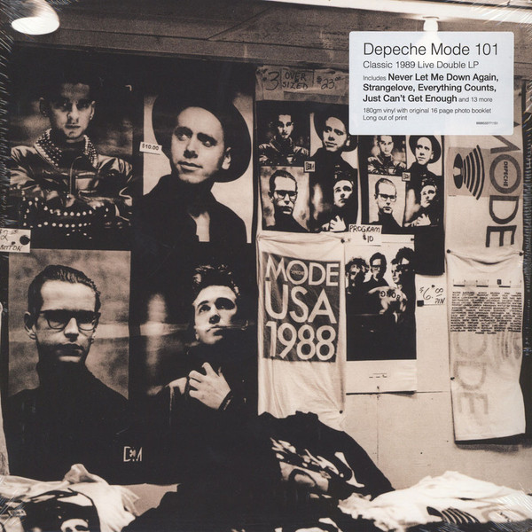

<!-- section break -->

1. Pimpf (0:53)
2. Behind The Wheel (5:41)
3. Strangelove (4:42)
4. Something To Do (3:45)
5. Blasphemous Rumours (5:06)
6. Stripped (6:16)
7. Somebody (4:27)
8. Things You Said (4:09)
9. Black Celebration (4:33)
10. Shake The Disease (4:57)
11. Pleasure Little Treasure (4:35)
12. People Are People (4:54)
13. A Question Of Time (4:09)
14. Never Let Me Down Again (6:22)
15. Master And Servant (4:24)
16. Just Can't Get Enough (4:01)
17. Everything Counts (6:07)

<!-- section break -->

## Spotify


## Release Information
|  Key           | Value                                                |
| ---------------| ---------------------------------------------------- |
| Release Year   | 2016                                   |
| Discogs Link   | [Depeche Mode - 101](https://www.discogs.com/release/9191026-Depeche-Mode-101) |
| Label          | Mute |
| Format         | Vinyl 2× LP Album Reissue (180 Gram, Gatefold Sleeve) |
| Catalog Number | Stumm101 |
| Notes | Recorded Live at the Pasadena Rose Bowl, June 18th 1988 (P) 1989 Venusnote Ltd. under exclusive licence to Sony Music Entertainment International Ltd. (C) 1989, 2016 Venusnote Ltd. under exclusive licence to Sony Music Entertainment International Ltd. All trademarks and logos are protected. Made in the EU. Sony Music Entertainment International Service GmbH, PO Box 510, 33311 Gütersloh, Germany. sonymusic.com depechemode.com Includes a 16-page booklet of photos.  The runout strings are stamped  |