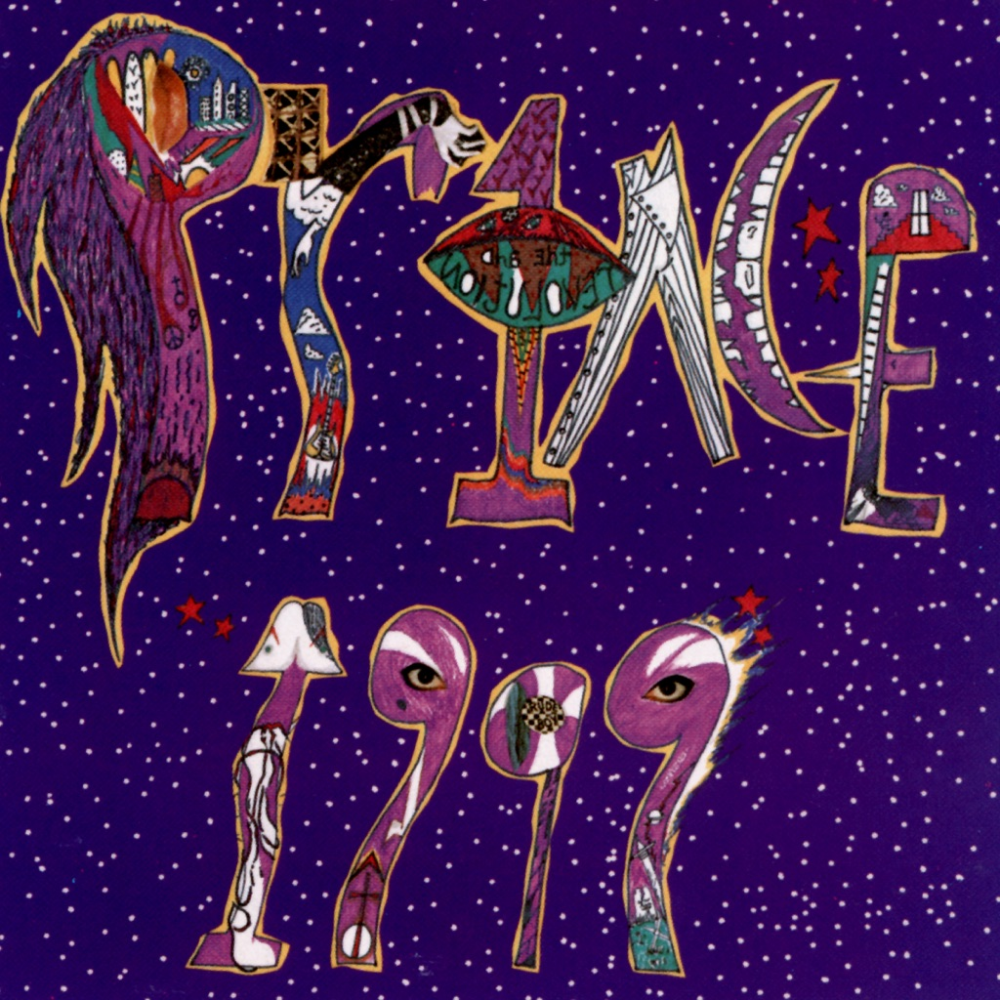

<!-- section break -->

1. 1999 (6:14)
2. Little Red Corvette (5:04)
3. Delirious (4:00)
4. Let's Pretend We're Married (7:20)
5. D.M.S.R. (8:18)
6. Automatic (9:26)
7. Something In The Water (Does Not Compute) (4:02)
8. Free (5:07)
9. Lady Cab Driver (8:17)
10. All The Critics Love U In New York (5:58)
11. International Lover (6:38)

<!-- section break -->

## Spotify


## Videos
### International Lover (2019 Remaster)
 

### More Videos

- [Prince - 1999 (Official Music Video)](https://www.youtube.com/watch?v=rblt2EtFfC4)
- [Prince - Little Red Corvette (Official Music Video)](https://www.youtube.com/watch?v=v0KpfrJE4zw)
- [Delirious (2019 Remaster)](https://www.youtube.com/watch?v=ilP0dGXFNgw)
- [Lady Cab Driver](https://www.youtube.com/watch?v=YQ7Tcw8yqho)
- [Prince - Let's Pretend We're Married (Official Music Video)](https://www.youtube.com/watch?v=KXkCtFo4ttI)
- [Lady Cab Driver (2019 Remaster)](https://www.youtube.com/watch?v=w8KRBcfajfQ)
- [Something in the Water (Does Not Compute)](https://www.youtube.com/watch?v=LwoSyRd5ngY)
- [Free](https://www.youtube.com/watch?v=uHJFG4tmoeE)
- [All the Critics Love U in New York](https://www.youtube.com/watch?v=6Rtjb1SMGVE)
- [International Lover](https://www.youtube.com/watch?v=40sGh8zBD4U)

## Release Information
|  Key           | Value                                                |
| ---------------| ---------------------------------------------------- |
| Release Year   | 2019                                   |
| Discogs Link   | [Prince - 1999](https://www.discogs.com/release/14462421-Prince-1999) |
| Label          | Warner Records |
| Format         | Vinyl 2× LP Album Limited Edition Reissue Remastered (Purple, 180 gram) |
| Catalog Number | RR1 23720 |
| Notes | Red sticker on shrink: The iconic album remastered for the very first time Limited edition, 180g 2LP set pressed on Prince purple vinyl Includes download code RR1 23720  Vinyl housed in die-cut black paper, polylined inner sleeves, and come with two replica inner sleeves containing pictures, credits and lyrics.  Album title stylized as **1999** on labels.  Cover, back Made in the E.U. PRINCE.COM |603497849987  Labels: RR1 23720 Made in the E.U. GEMA/BIEM • 603497849987  ℗ & © 2019, 1982 NPG Records, Inc. Under exclusive license to Warner Records Inc. Made in the E.U.  |