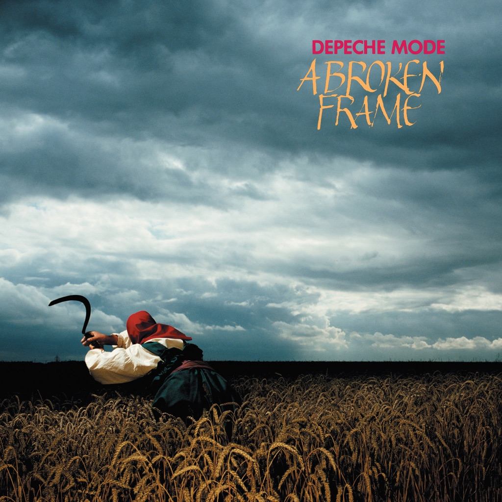

<!-- section break -->

1. Leave In Silence
2. My Secret Garden
3. Monument
4. Nothing To Fear
5. See You
6. Satellite
7. The Meaning Of Love
8. A Photograph Of You
9. Shouldn't Have Done That
10. The Sun & The Rainfall

<!-- section break -->

## Spotify


## Release Information
|  Key           | Value                                                |
| ---------------| ---------------------------------------------------- |
| Release Year   | 2016                                   |
| Discogs Link   | [Depeche Mode - A Broken Frame](https://www.discogs.com/release/8970950-Depeche-Mode-A-Broken-Frame) |
| Label          | Mute |
| Format         | Vinyl LP Album Reissue Remastered (Gatefold, 180 Gram) |
| Catalog Number | STUMM9 |
| Notes | Made in the EU |