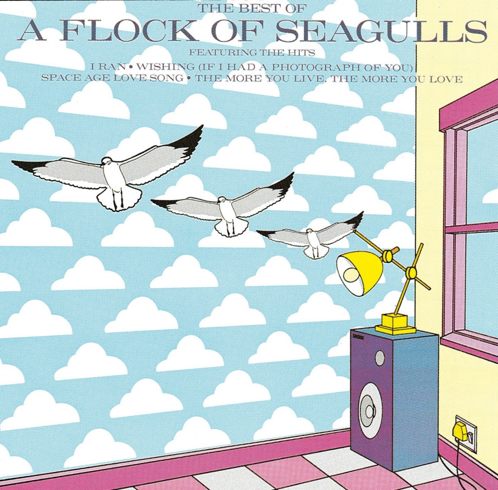

<!-- section break -->

1. Modern Love Is Automatic (3:49)
2. Messages (2:51)
3. I Ran (4:58)
4. Space  Age Love Song (3:45)
5. You Can Run (4:28)
6. Telecommunication (2:31)
7. Standing In The Doorway (4:41)
8. Don't Ask Me (2:46)
9. D.N.A. (2:30)
10. Tokyo (2:48)
11. Man Made (5:38)

<!-- section break -->

## Spotify


## Videos
### A Flock of Seagulls 1982 [Full Album With Bonus Tracks] [Remastered]
 

## Release Information
|  Key           | Value                                                |
| ---------------| ---------------------------------------------------- |
| Release Year   | 2023                                   |
| Discogs Link   | [A Flock Of Seagulls - A Flock Of Seagulls](https://www.discogs.com/release/26056165-A-Flock-Of-Seagulls-A-Flock-Of-Seagulls) |
| Label          | BMG |
| Format         | Vinyl LP Album Limited Edition Reissue Remastered Stereo (Orange) |
| Catalog Number | BMGCAT588CLP |
| Notes | Manufactured in Ireland. Hype sticker on shrink wrap.  |