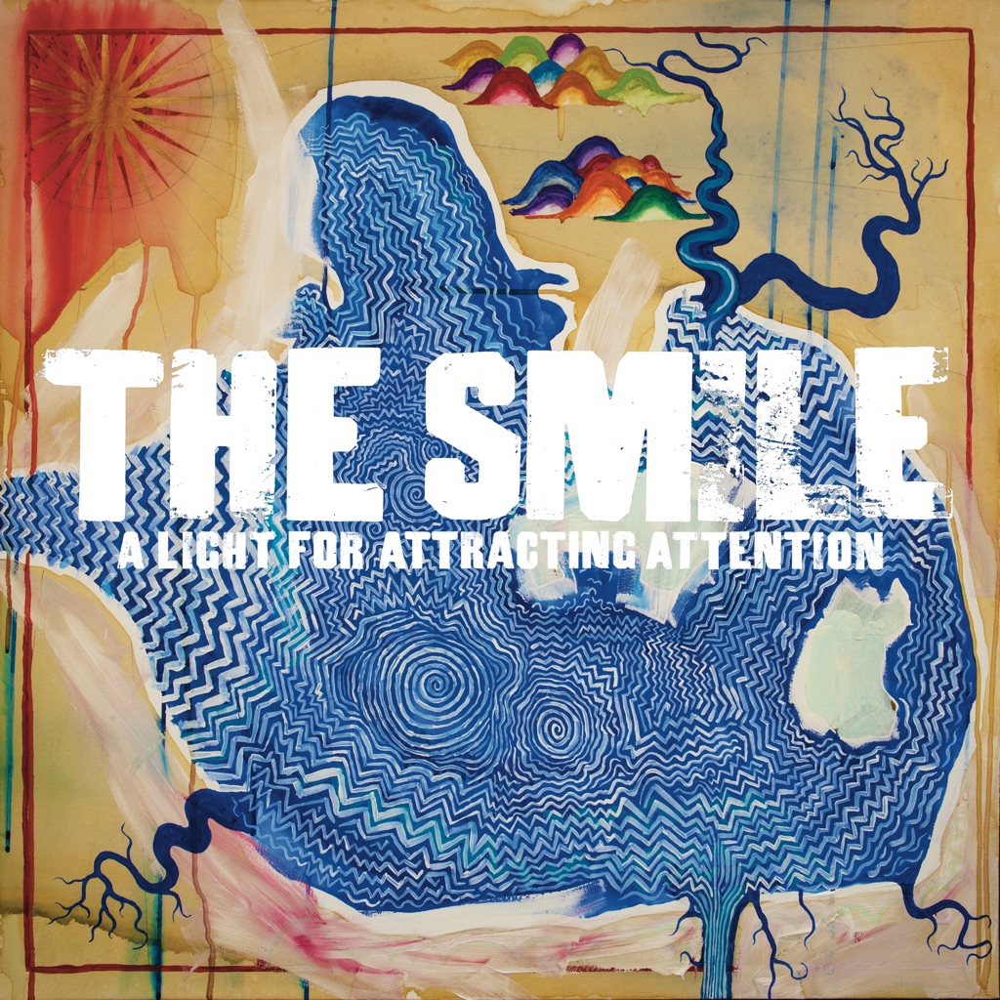

<!-- section break -->

1. The Same
2. The Opposite
3. You Will Never Work In Television Again
4. Pana-Vision
5. The Smoke
6. Speech Bubbles
7. Thin Thing
8. Open The Floodgates
9. Free In The Knowledge
10. A Hairdryer
11. Waving A White Flag
12. We Don't Know What Tomorrow Brings
13. Skrting On The Surface

<!-- section break -->

## Videos
### The Smile - The Same
 

### More Videos

- [The Smile - The Opposite](https://www.youtube.com/watch?v=72z6FJsVcbs)
- [The Smile - You Will Never Work In Television Again](https://www.youtube.com/watch?v=-EB5NhI2RQQ)
- [The Smile - Pana-vision](https://www.youtube.com/watch?v=wKXQhFXlFs4)
- [The Smile - The Smoke (16mm Film)](https://www.youtube.com/watch?v=tEPEqZnTwdo)
- [The Smile - Speech Bubbles](https://www.youtube.com/watch?v=GWiWIN9TKBs)
- [The Smile - Thin Thing (Official Video)](https://www.youtube.com/watch?v=J1_Cf55cS8I)
- [The Smile - Free in the Knowledge (Official Video)](https://www.youtube.com/watch?v=CXbncoiKLn8)
- [The Smile -  Free in the Knowledge](https://www.youtube.com/watch?v=5KP6sZIIKk4)
- [The Smile - A Hairdryer](https://www.youtube.com/watch?v=U5r4S4YjkF8)
- [The Smile - Waving A White Flag](https://www.youtube.com/watch?v=RlHEPF4Pqos)
- [The Smile - We Don't Know What Tomorrow Brings](https://www.youtube.com/watch?v=3oEkWwX9iX4)
- [The Smile - Skrting On The Surface](https://www.youtube.com/watch?v=_nmutqhuWFE)

## Release Information
|  Key           | Value                                                |
| ---------------| ---------------------------------------------------- |
| Release Year   | 2022                                   |
| Discogs Link   | [The Smile - A Light For Attracting Attention](https://www.discogs.com/release/23608229-The-Smile-A-Light-For-Attracting-Attention) |
| Label          | XL Recordings |
| Format         | Vinyl 2× LP Album Limited Edition (Yellow) |
| Catalog Number | XL1196LPE |
| Notes | Optimal pressing.  Copies purchased direct from XL Recordings online store came with a “THE SMILE” postcard. Packaged in a gatefold cover with a satin feel coating finish and spot-gloss text to the front. Includes matte finish printed inner sleeves. Undersized picture labels. Yellow hype sticker and barcode sticker are both applied to the shrink-wrap.  Tracks are numbered sequentially across sides in the inner gatefold.  Front sticker: Debut album from new group The Smile Comprising Radiohead's Thom Yorke and Jonny Greenwood, and Sons Of Kemet's Tom Skinner Limited edition yellow vinyl  Recorded at Wack Formula London Mastered [...] at Gateway Mastering, Portland, Maine Strings [...] recorded at Air Edel Studio  Woodblock lettering from a collection held by The Bodleian Library, Oxford Digital fonts by Andrew Leman at HPLHS.org  ℗2022 Self Help Tapes LLP under exclusive license to XL Recordings Ltd. ©2022 Self Help Tapes LLP under exclusive license to XL Recordings Ltd. Published by Warner Chappell Music, Kobalt Music and Copyright Control. |