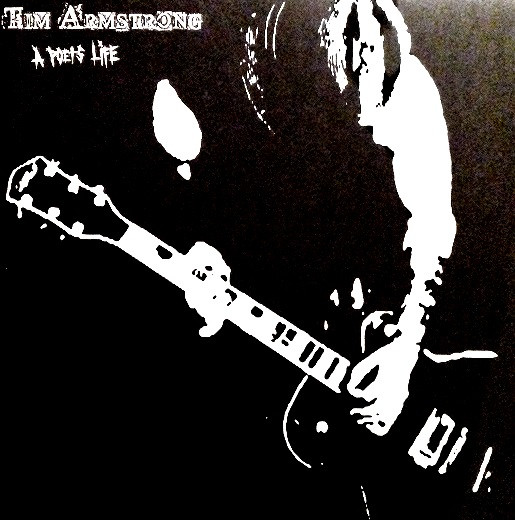

<!-- section break -->

1. Wake Up
2. Hold On
3. Into Action
4. Translator
5. Take This City
6. Inner City Violence
7. Oh No
8. Lady Demeter
9. Among The Dead
10. Cold Blooded

<!-- section break -->

## Spotify


## Videos
### Tim Armstrong - Among The Dead
 

### More Videos

- [Tim Armstrong - Wake Up](https://www.youtube.com/watch?v=5YuCERKiRIo)
- [Tim Armstrong - Hold On](https://www.youtube.com/watch?v=modmuWBssl4)
- [Tim Armstrong - Into Action](https://www.youtube.com/watch?v=0zmIR1aAGYE)
- [Tim Armstrong - Translator](https://www.youtube.com/watch?v=Uc_iFszDRuA)
- [Tim Armstrong - Take This City](https://www.youtube.com/watch?v=scxEEqX-hXo)
- [Tim Armstrong - Inner City Violence](https://www.youtube.com/watch?v=HiErApQp0wg)
- [Tim Armstrong - Oh No](https://www.youtube.com/watch?v=NQswLcNb2tk)
- [Tim Armstrong - Lady Demeter](https://www.youtube.com/watch?v=pYRrbBm30N8)
- [Tim Armstrong - Cold Blooded](https://www.youtube.com/watch?v=yDCTI84is3o)

## Release Information
|  Key           | Value                                                |
| ---------------| ---------------------------------------------------- |
| Release Year   | 2018                                   |
| Discogs Link   | [Tim Armstrong - A Poet's Life](https://www.discogs.com/release/11895222-Tim-Armstrong-A-Poets-Life) |
| Label          | Hellcat Records |
| Format         | Vinyl LP Album Record Store Day Limited Edition Reissue (White) |
| Catalog Number | 0491-1 |
| Notes | Gatefold cover. White vinyl.   The first vinyl pressing of the Rancid leader's solo album is on white vinyl for Record Store Day 2018. Limited Run / Regional Focus Release. 900 copies made. |