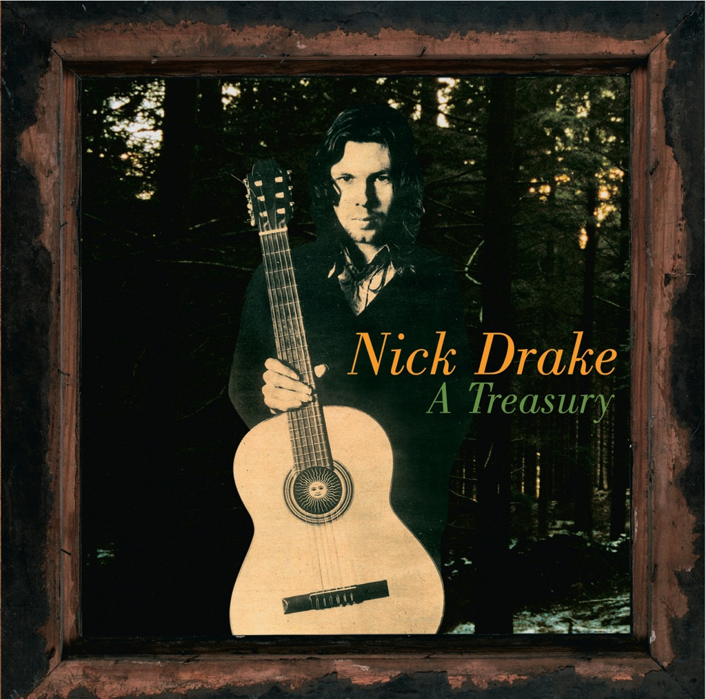

<!-- section break -->

1. Introduction
2. Hazey Jane II
3. River Man
4. Cello Song
5. Hazey Jane I
6. Pink Moon
7. Poor Boy
8. Magic
9. Place To Be
10. Northern Sky
11. Road
12. Fruit Tree
13. Black Eyed Dog
14. Way To Blue
15. From The Morning

<!-- section break -->

## Spotify


## Videos
### Nick Drake: River Man
 

### More Videos

- [Nick Drake - Black Eyed Dog](https://www.youtube.com/watch?v=PabxhKTkE0U)

## Release Information
|  Key           | Value                                                |
| ---------------| ---------------------------------------------------- |
| Release Year   | 2014                                   |
| Discogs Link   | [Nick Drake - A Treasury](https://www.discogs.com/release/6354022-Nick-Drake-A-Treasury) |
| Label          | Island Records |
| Format         | Vinyl LP Compilation Reissue |
| Catalog Number | 4700056/00602547000569 |
| Notes | Includes inner sleeve with lyrics and some words from Peter Paphides  Labels:  ℗ © 2004 Universal Island Records Ltd.  Made in the EU |