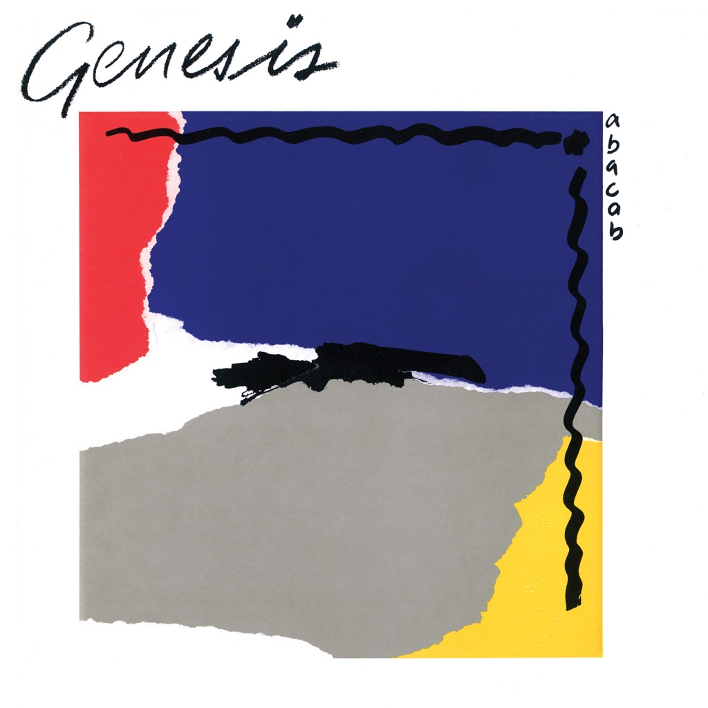

<!-- section break -->

1. Abacab
2. No Reply At All
3. Me And Sarah Jane
4. Keep It Dark
5. Dodo
6. Lurker
7. Who Dunnit?
8. Man On The Corner
9. Like It Or Not
10. Another Record

<!-- section break -->

## Spotify


## Release Information
|  Key           | Value                                                |
| ---------------| ---------------------------------------------------- |
| Release Year   | 1981                                   |
| Discogs Link   | [Genesis - Abacab](https://www.discogs.com/release/2294111-Genesis-Abacab) |
| Label          | Charisma |
| Format         | Vinyl LP Album (CORG - Cyan/Orange/Red/Green Cover) |
| Catalog Number | CBR 102 |
| Notes | Tracks B1/B2 appear as two tracks on the sleeve, inner sleeve and label, but as one track on the release  Contains a special, picture inner sleeve  This version has a cyan, orange, red and green embossed cover  A version with a blue/grey cover is [r667424]  |