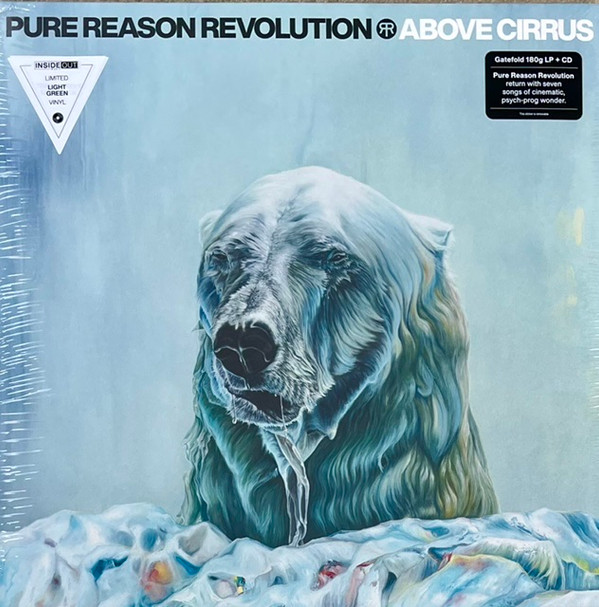

<!-- section break -->

1. Our Prism
2. New Kind Of Evil
3. Phantoms
4. Cruel Deliverance
5. Scream Sideways
6. Dead Butterfly
7. Lucid
8. Our Prism (3:34)
9. New Kind Of Evil (8:32)
10. Phantoms (3:51)
11. Cruel Deliverance (5:55)
12. Scream Sideways (10:09)
13. Dead Butterfly (7:09)
14. Lucid (6:49)

<!-- section break -->

## Spotify


## Videos
### Lucid
 

### More Videos

- [Our Prism](https://www.youtube.com/watch?v=lJJ2vUfY5ps)
- [Scream Sideways](https://www.youtube.com/watch?v=DMZuXRR4Mzw)

## Release Information
|  Key           | Value                                                |
| ---------------| ---------------------------------------------------- |
| Release Year   | 2022                                   |
| Discogs Link   | [Pure Reason Revolution - Above Cirrus](https://www.discogs.com/release/23119040-Pure-Reason-Revolution-Above-Cirrus) |
| Label          | Inside Out Music |
| Format         | Vinyl LP Album (Green [Light], 180g), CD Album, All Media Limited Edition |
| Catalog Number | IOM628 |
| Notes | Inside Out store exclusive release. Limited to 300 copies worldwide. Gatefold release. CD housed in a transparent sleeve and lyric sheet included. Some copies including a signed postcard.  LPs tracks positions given sequentially reardless of sides on back.  Track times taken from mediaplayer on PC.  Hype sticker: Gatefold 180g LP + CD Pure Reason Revolution return with seven songs of cinematic, psych-prog wonder. |