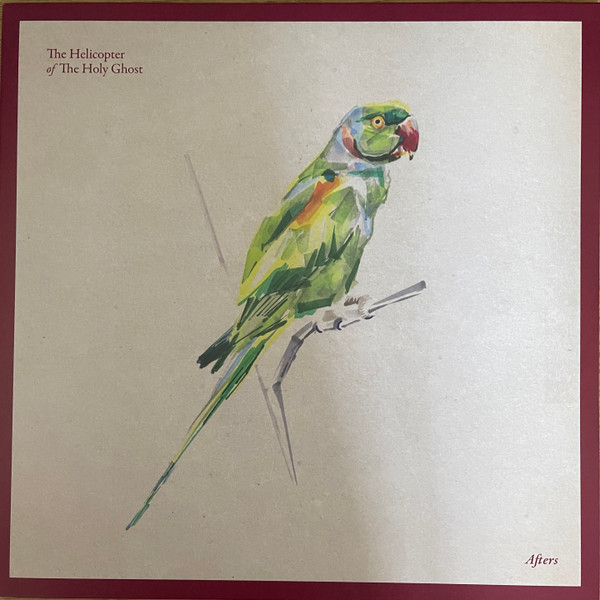

<!-- section break -->

1. Slow Down
2. Difficult Song
3. Tony Got A Car
4. A Little Longer
5. Hangar Lane Gyratory System, 4.44am
6. I Will Never Hurt
7. End Of Loneliness
8. You Too
9. I Didn't

<!-- section break -->

## Spotify


## Videos
### End of Loneliness
 

### More Videos

- [I Didn't](https://www.youtube.com/watch?v=e5HTe6s51_c)
- [A Little Longer](https://www.youtube.com/watch?v=pdKa1G5heP8)
- [You Too](https://www.youtube.com/watch?v=YcrKtkVUnfs)
- [I Will Never Hurt](https://www.youtube.com/watch?v=KpGCMUA-C90)
- [Slow Down](https://www.youtube.com/watch?v=HJH6CbY_KGc)
- [Hangar Lane Gyratory System; 4.44am](https://www.youtube.com/watch?v=ZXAB8w8Y3t0)
- [Difficult Song](https://www.youtube.com/watch?v=SUl84NqIqJM)

## Release Information
|  Key           | Value                                                |
| ---------------| ---------------------------------------------------- |
| Release Year   | 2021                                   |
| Discogs Link   | [The Helicopter Of The Holy Ghost - Afters](https://www.discogs.com/release/19860235-The-Helicopter-Of-The-Holy-Ghost-Afters) |
| Label          | Kscope |
| Format         | Vinyl LP Album |
| Catalog Number | KSCOPE1120 |
