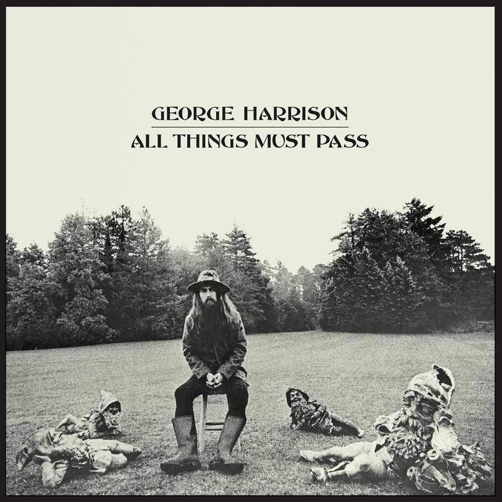

<!-- section break -->

1. I'd Have You Anytime
2. My Sweet Lord
3. Wah-Wah
4. Isn't It A Pity (Version One)
5. What Is Life
6. If Not For You
7. Behind That Locked Door
8. Let It Down
9. Run Of The Mill
10. Beware Of Darkness
11. Apple Scruffs
12. Ballad Of Sir Frankie Crisp (Let It Roll)
13. Awaiting On You All
14. All Things Must Pass
15. I Dig Love
16. Art Of Dying
17. Isn't It A Pity (Version Two)
18. Hear Me Lord
19. Apple Jam
20. Out Of The Blue
21. It's Johnny's Birthday
22. Plug Me In
23. I Remember Jeep
24. Thanks For The Pepperoni

<!-- section break -->

## Spotify


## Videos
### Hear Me Lord (Remastered 2014)
 

### More Videos

- [George Harrison - All Things Must Pass (2020 Mix / Audio)](https://www.youtube.com/watch?v=QWV4pFV5nX4)
- [George Harrison - My Sweet Lord](https://www.youtube.com/watch?v=SP9wms6oEMo)
- [George Harrison - I'd Have You Anytime](https://www.youtube.com/watch?v=ZI64iGZkoks)
- [George Harrison - Let It Down](https://www.youtube.com/watch?v=5Gyk_gvuIoI)
- [George Harrison - Ballad Of Sir Frankie Crisp (Let It Roll)](https://www.youtube.com/watch?v=6QCWZJJr3BM)
- [George Harrison - What Is Life](https://www.youtube.com/watch?v=fiH9edd25Bc)
- [Wah-Wah (Remastered 2014)](https://www.youtube.com/watch?v=yNfBDnnZyuo)
- [Isn't It A Pity (Remastered 2014)](https://www.youtube.com/watch?v=lIbVWNy7HBk)
- [If Not For You (Remastered 2014)](https://www.youtube.com/watch?v=eDAaKxlaBQ4)
- [Behind That Locked Door (Remastered 2014)](https://www.youtube.com/watch?v=VHX-MFg2Zqw)
- [Run Of The Mill (Remastered 2014)](https://www.youtube.com/watch?v=h_9RFTN2ikU)
- [Beware Of Darkness (Remastered 2014)](https://www.youtube.com/watch?v=0LrxYds2UNE)
- [Apple Scruffs (Remastered 2014)](https://www.youtube.com/watch?v=Bw-ky3BvAFI)
- [Awaiting On You All (Remastered 2014)](https://www.youtube.com/watch?v=fbyHdlCVrRo)
- [I Dig Love (Remastered 2014)](https://www.youtube.com/watch?v=EE9GWOeMDkE)
- [Art Of Dying (Remastered 2014)](https://www.youtube.com/watch?v=tmo8L7NlURQ)
- [Isn't It A Pity (Version Two / Remastered 2014)](https://www.youtube.com/watch?v=bHV2CY5LOSQ)
- [Out Of The Blue (Remastered 2014)](https://www.youtube.com/watch?v=hD_ZVuwfkS4)
- [Plug Me In (Remastered 2014)](https://www.youtube.com/watch?v=BgpwqkYYyUo)
- [I Remember Jeep (Remastered 2014)](https://www.youtube.com/watch?v=PFY6SBhFZHc)
- [Thanks For The Pepperoni (Remastered 2014)](https://www.youtube.com/watch?v=rDDA0tSxzVU)

## Release Information
|  Key           | Value                                                |
| ---------------| ---------------------------------------------------- |
| Release Year   | 2017                                   |
| Discogs Link   | [George Harrison - All Things Must Pass](https://www.discogs.com/release/9882471-George-Harrison-All-Things-Must-Pass) |
| Label          | Apple Records |
| Format         | Vinyl 3× LP Album Reissue Remastered Stereo (180g), Box Set |
| Catalog Number | STCH 639 |
| Notes | Cover sticker: Remastered for vinyl from the original analogue stereo master tapes. Album replicates design and construction of the original release. 180g Heavyweight vinyl.  ℗ 2014 The copyright in this sound recording is owned by G.H. Estate Limited under exclusive license to Calderstone Productions Limited (a division of Universal Music Group). © 2017 G.H. Estate Limited.  Sticker on rear shrinkwrap: Made in Germany. On LP labels: Mfd. in E.U.  Includes a 6-panel fold-out poster. Each LP comes in a printed inner sleeve.  For the songs written by George Harrison: All lyrics copyright 1970 for the world by Harrisongs Music, Ltd., England All rights for the United States and Canada controlled by Harrisongs Music, Inc.  For the songs written by Bob Dylan: All lyrics copyright 1970 by Big Sky Music.  Apple Jam (Recorded during sides 1, 2, 3 & 4.) 'It's Johnny's Birthday' based on 'Congratulations' by Bill Martin & Phil Coulter and published by Peter Maurice Music Co/EMI Music Publishing Ltd. Other tracks: Copyright 1970 for the world by Harrisongs Music, Ltd., England. All rights for the United States and Canada controlled by Harrisongs Music, Inc. |