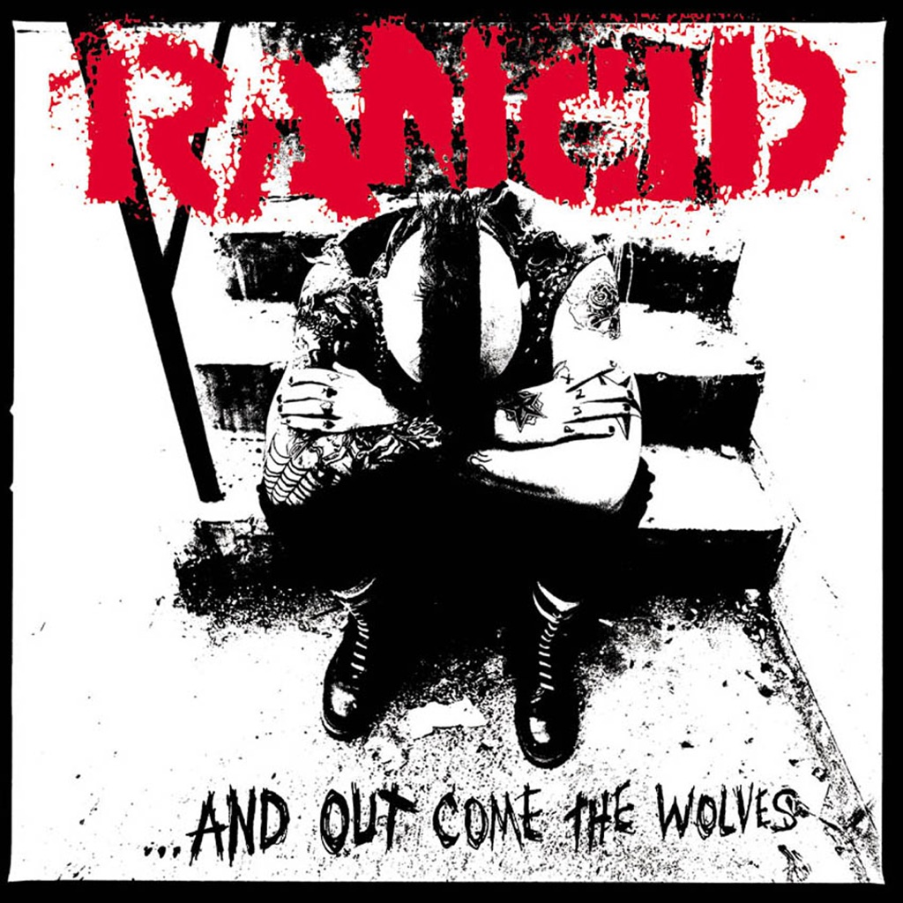

<!-- section break -->

1. Maxwell Murder (1:26)
2. The 11th Hour (2:28)
3. Roots Radicals (2:48)
4. Time Bomb (2:24)
5. Olympia WA. (3:31)
6. Lock, Step & Gone (2:25)
7. Junkie Man (3:05)
8. Listed M.I.A. (2:22)
9. Ruby Soho (2:38)
10. Daly City Train (3:21)
11. Journey To The End Of The East Bay (3:12)
12. She's Automatic (1:35)
13. Old Friend (2:54)
14. Disorder And Disarray (2:49)
15. The Wars End (1:54)
16. You Don't Care Nothin' (2:28)
17. As Wicked (2:41)
18. Avenues & Alleyways (3:12)
19. The Way I Feel (2:35)

<!-- section break -->

## Spotify


## Videos
### Rancid - Daly City Train (Full Album Stream)
 

### More Videos

- [Rancid - Maxwell Murder (Full Album Stream)](https://www.youtube.com/watch?v=XcccqG6-dDg)
- [Rancid - The 11th Hour (Full Album Stream)](https://www.youtube.com/watch?v=Ly5-hv5-iTU)
- [Rancid - Roots Radicals [Official Video]](https://www.youtube.com/watch?v=wpzkGQhftMw)
- [Rancid - Time Bomb](https://www.youtube.com/watch?v=DhKHAopx7D0)
- [Rancid - Olympia, WA (Full Album Stream)](https://www.youtube.com/watch?v=j5HZ5Bd6DUY)
- [Rancid - Lock, Step, & Gone (Full Album Stream)](https://www.youtube.com/watch?v=O-vzicKAUTY)
- [Rancid - Junkie Man (Full Album Stream)](https://www.youtube.com/watch?v=gXXT2KvhwZs)
- [Rancid - Listed M.I.A. (Full Album Stream)](https://www.youtube.com/watch?v=Azlr8By0lFw)
- [Rancid - Ruby Soho (Full Album Stream)](https://www.youtube.com/watch?v=58JtsAkRfNs)
- [Rancid - Journey To The End Of The East Bay (Full Album Stream)](https://www.youtube.com/watch?v=0DrLoalgK3g)
- [Rancid - She's Automatic (Full Album Stream)](https://www.youtube.com/watch?v=J3hAkO5aD08)
- [Rancid - Old Friend (Full Album Stream)](https://www.youtube.com/watch?v=PV1NwV7DrAc)
- [Rancid - Disorder and Disarray (Full Album Stream)](https://www.youtube.com/watch?v=h6JRureYAAE)
- [Rancid - The Wars End (Full Album Stream)](https://www.youtube.com/watch?v=OAtiHyzweFA)
- [Rancid - You Don't Care Nothin (Full Album Stream)](https://www.youtube.com/watch?v=bDzzicN1mLU)
- [Rancid - As Wicked (Full Album Stream)](https://www.youtube.com/watch?v=g6lFcG7IAt8)
- [Rancid - Avenues and Alleyways (Full Album Stream)](https://www.youtube.com/watch?v=kInWnJ9et1s)
- [Rancid - The Way I Feel (Full Album Stream)](https://www.youtube.com/watch?v=X7sILDfQXdk)

## Release Information
|  Key           | Value                                                |
| ---------------| ---------------------------------------------------- |
| Release Year   | 2016                                   |
| Discogs Link   | [Rancid - ...And Out Come The Wolves](https://www.discogs.com/release/8007348-Rancid-And-Out-Come-The-Wolves) |
| Label          | Epitaph |
| Format         | Vinyl LP Album Limited Edition Reissue Remastered (Gold, 180g) |
| Catalog Number | 7441-1 |
| Notes | To celebrate the 20th anniversary of this very special release in our history, Epitaph Records is proud to present the deluxe 20th Anniversary edition of Rancid’s …and Out Come The Wolves. Released at the height of the 90’s wave of punk resurgence, …and Out Come The Wolves is arguably on the most important albums of that decade and features tracks that became punk standards. – Audiophile 180 gram gold vinyl – Remastered from the original master tapes – Includes giant poster and lyric sheet LP contains Download card.Comes with fold-out poster. Limited to 1500 copies  ©+℗ 1995 Epitaph Records All songs published by I Want To Go Where The Action Is Music (King Roy Music B.M.I.)  Intro to A1 from the movie "Gringo" by Lech Kowalski. Thanks to [a=Jim Carroll] for coming down & writing a poem to our song. |