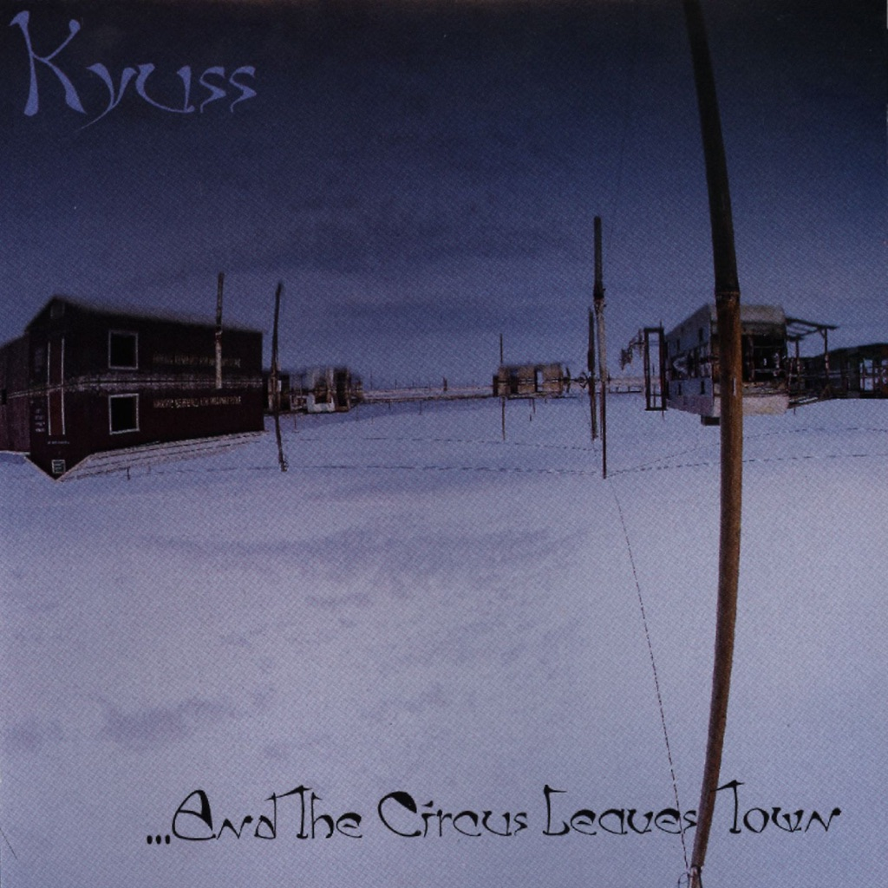

<!-- section break -->

1. Hurricane (2:41)
2. One Inch Man (3:29)
3. Thee Ol' Boozeroony (2:47)
4. Gloria Lewis (4:01)
5. Phototropic (5:18)
6. El Rodeo (5:28)
7. Jumbo Blimp Jumbo (4:37)
8. Tangy Zizzle (2:38)
9. Size Queen (3:46)
10. Catamaran (2:59)
11. Spaceship Landing (11:15)

<!-- section break -->

## Spotify


## Videos
### Kyuss - One Inch Man
 

### More Videos

- [Hurricane](https://www.youtube.com/watch?v=9S-HOU6IehU)
- [Spaceship Landing](https://www.youtube.com/watch?v=XJeD2tsKBoA)
- [El Rodeo](https://www.youtube.com/watch?v=UnUHC7LoiWE)
- [Catamaran](https://www.youtube.com/watch?v=kdkeorF6Fiw)
- [Jumbo Blimp Jumbo](https://www.youtube.com/watch?v=wC5UKU7xh_4)

## Release Information
|  Key           | Value                                                |
| ---------------| ---------------------------------------------------- |
| Release Year   | 2016                                   |
| Discogs Link   | [Kyuss - ...And The Circus Leaves Town](https://www.discogs.com/release/8901477-Kyuss-And-The-Circus-Leaves-Town) |
| Label          | Elektra |
| Format         | Vinyl LP Album Repress (Blue Marbled, 180 Gram) |
| Catalog Number | 7559-61811-1 |
| Notes | Recorded 3/1/95 - 3/20/95. "Catamaran" previously recorded by Yawning Man.  This repress is largely identical to the 1999 German Repress. There's a "180g COLOURED VINYL" sticker on shrinkwrap. This version is solid blue, whereas the 1999 version ([r=1768971]) is clear blue. ---------------------------------------------------------------------------------------------------- The two tracks appearing after "Spaceship Landing" on other versions (M'deea & Day One) are not included here.  |