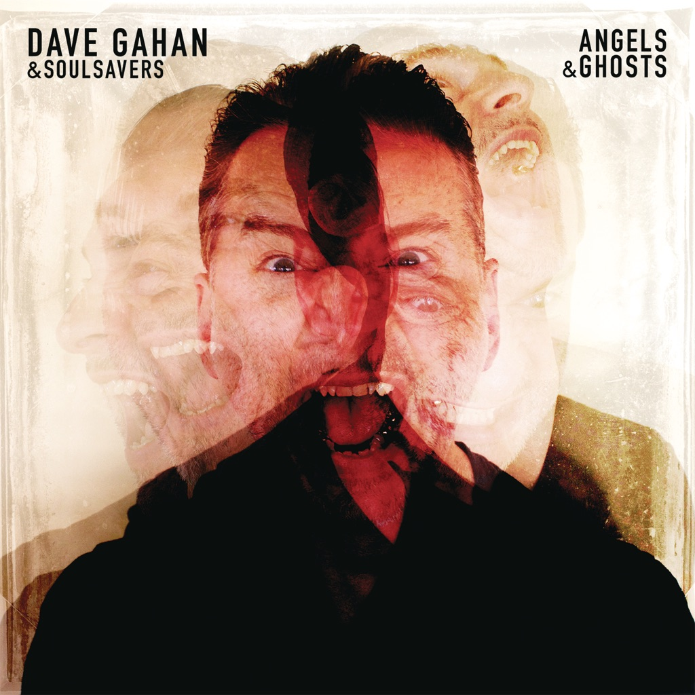

<!-- section break -->

1. Shine
2. You Owe Me
3. Tempted
4. All Of This And Nothing
5. One Thing
6. Don't Cry
7. Lately
8. The Last Time
9. My Sun

<!-- section break -->

## Spotify


## Videos
### Dave Gahan, Soulsavers - Shine (Official Video)
 

### More Videos

- [Dave Gahan, Soulsavers - All of This and Nothing (Lyric Video)](https://www.youtube.com/watch?v=2k11RlYp51I)

## Release Information
|  Key           | Value                                                |
| ---------------| ---------------------------------------------------- |
| Release Year   | 2015                                   |
| Discogs Link   | [Dave Gahan - Angels & Ghosts](https://www.discogs.com/release/7829894-Dave-Gahan-Soulsavers-Angels-Ghosts) |
| Label          | Columbia |
| Format         | Vinyl LP Album |
| Catalog Number | 88875136551 |
| Notes | Includes digital download code, valid until 10/24/16. Printed inner sleeve with lyrics.  © & ℗ 2015 Venusnote Ltd. under exclusive license to Columbia Records, a Division of Sony Music Entertainment / COLUMBIA is the exclusive trademark of Sony Music Entertainment. Distributed by Sony Music Entertainment. Sony Music Entertainment International Services GmbH.  Made in the EU.  All songs © 2015 EMI Blackwood Music Inc. o/b/o JJSR Productions Inc. (BMI) / Mute Song (BMI).  Mixed at The Strongroom. Mastered at Abbey Road. All lead vocals recorded at Blanco Studio (New York, NY). Recorded at Sunset Sound - Electric Lady - Real World - Famous Times - The Mouse House - Blanco - Black Lodge - Casa G - Talk Back |