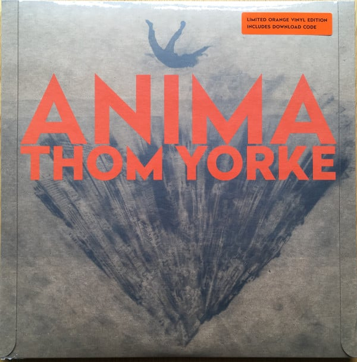

<!-- section break -->

1. Traffic
2. Last I Heard (...He Was Circling The Drain)
3. Twist
4. Dawn Chorus
5. I Am A Very Rude Person
6. Not The News
7. The Axe
8. Impossible Knots
9. Runwayaway
10. (Ladies & Gentlemen, Thank You For Coming)

<!-- section break -->

## Spotify


## Release Information
|  Key           | Value                                                |
| ---------------| ---------------------------------------------------- |
| Release Year   | 2019                                   |
| Discogs Link   | [Thom Yorke - Anima](https://www.discogs.com/release/13888965-Thom-Yorke-Anima) |
| Label          | XL Recordings |
| Format         | Vinyl 2× 12" 33 ⅓ RPM Album Limited Edition (Orange) |
| Catalog Number | XL987LPE |
| Notes | Includes download code for tracks A1 to D2.  Some came with limited brown paper bag and sticker with album logo printed on it, given to a limited amount of record stores to hand out with purchase of vinyl as promotion.  |