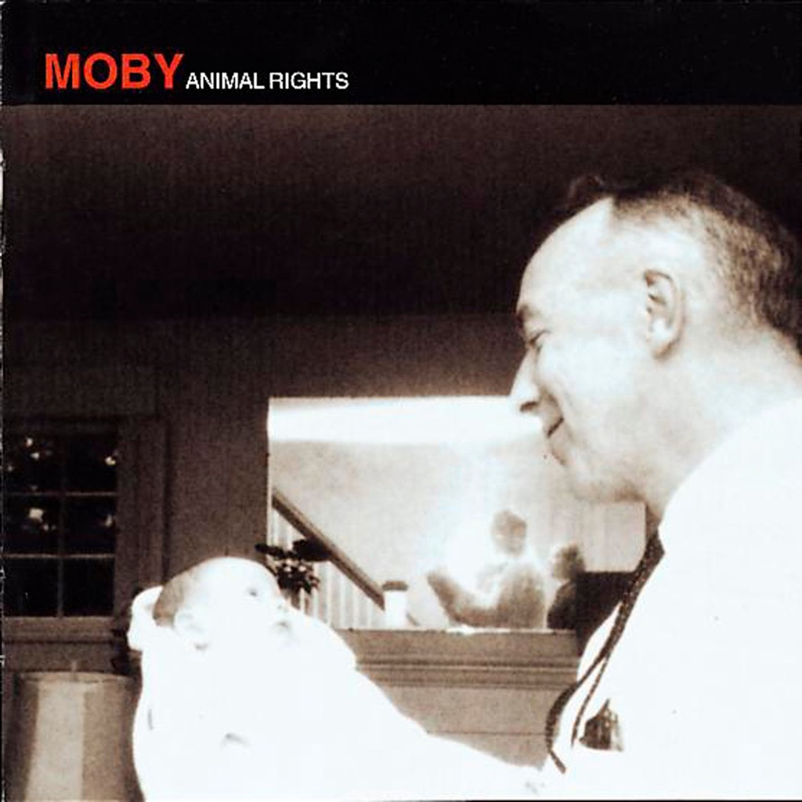

<!-- section break -->

1. Now I Let Go
2. Come On Baby
3. Someone To Love
4. Heavy Flow
5. You
6. My Love Will Never Die
7. Soft
8. Say It's All Mine
9. That's When I Reach For My Revolver
10. Face It
11. Living
12. Love Song For My Mum

<!-- section break -->

## Spotify


## Release Information
|  Key           | Value                                                |
| ---------------| ---------------------------------------------------- |
| Release Year   | 2016                                   |
| Discogs Link   | [Moby - Animal Rights](https://www.discogs.com/release/8534931-Moby-Animal-Rights) |
| Label          | Mute |
| Format         | Vinyl LP Album Limited Edition Reissue (180g) |
| Catalog Number | STUMM 150 |
| Notes | If purchased with other re-issues via Pledgemusic, a 12x12 flat of the play album artwork was included. |