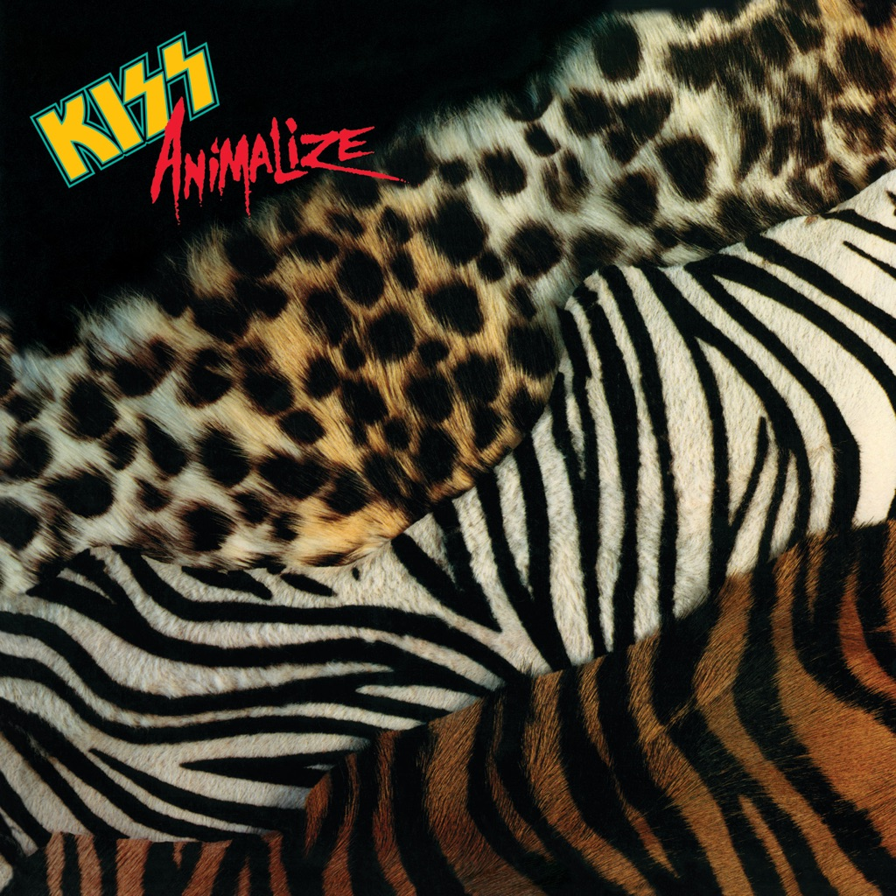

<!-- section break -->

1. I've Had Enough (Into The Fire)
2. Heaven's On Fire
3. Burn Bitch Burn
4. Get All You Can Take
5. Lonely Is The Hunter
6. Under The Gun
7. Thrills In The Night
8. While The City Sleeps
9. Murder In High Heels

<!-- section break -->

## Spotify


## Release Information
|  Key           | Value                                                |
| ---------------| ---------------------------------------------------- |
| Release Year   | 1984                                   |
| Discogs Link   | [Kiss - Animalize](https://www.discogs.com/release/1378646-Kiss-Animalize) |
| Label          | Vertigo |
| Format         | Vinyl LP Album Stereo |
| Catalog Number | VERL 18 |
| Notes | VERL 18 appears on spine, back cover, inner sleeve and labels 822 415-1 appears on labels 822 495-1 appears on back cover  |