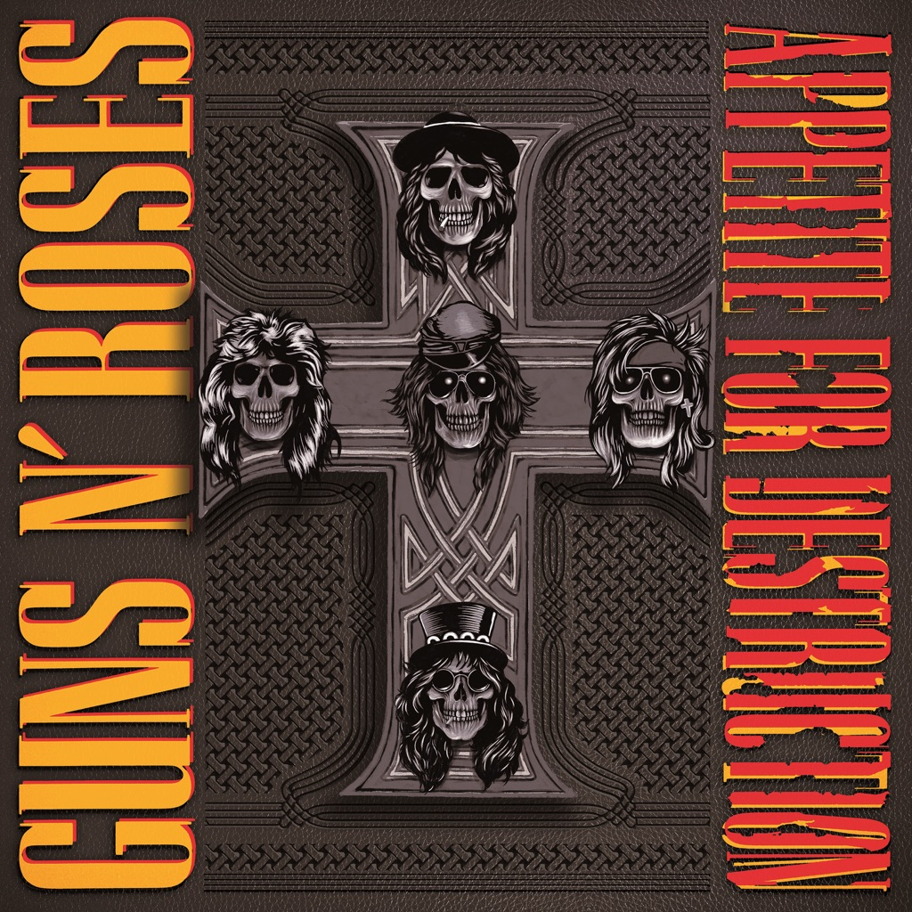

<!-- section break -->

1. G
2. Welcome To The Jungle (4:31)
3. It's So Easy (3:21)
4. Nightrain (4:26)
5. Out Ta Get Me (4:20)
6. Mr. Brownstone (3:46)
7. Paradise City (6:46)
8. R
9. My Michelle (3:39)
10. Think About You (3:50)
11. Sweet Child O' Mine (5:55)
12. You're Crazy (3:15)
13. Anything Goes (3:25)
14. Rocket Queen (6:13)

<!-- section break -->

## Spotify


## Videos
### Guns N Roses  Appetite for Destruction 1987  Full Album
 

## Release Information
|  Key           | Value                                                |
| ---------------| ---------------------------------------------------- |
| Release Year   | 2015                                   |
| Discogs Link   | [Guns N' Roses - Appetite For Destruction](https://www.discogs.com/release/7492229-Guns-N-Roses-Appetite-For-Destruction) |
| Label          | Geffen Records |
| Format         | Vinyl LP Album Reissue (180 gram) |
| Catalog Number | 00720642414811 |
| Notes | Made in the EU. Universal International Music BVGerrit van der veenlaan4, 3743 DN, Baarn, Netherlands.  Release date not found anywhere on the item itself, it was provided by the pressing plant when asked about it.  A subsequent repressing was made using the same stamper for side A and a different one for side B: see [r=10323040] |