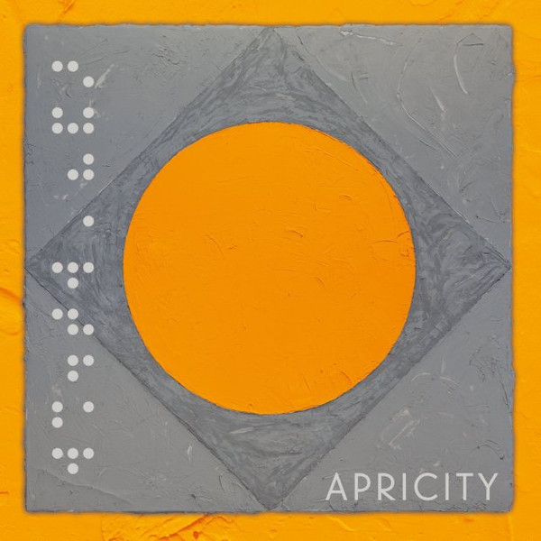

<!-- section break -->

1. Coal Mine
2. Plane Crash In Kansas
3. No Peace
4. Sun Rays
5. Into Eternity
6. Rebel Lands
7. Seraphim
8. Portal
9. Evolution
10. Apricity

<!-- section break -->

## Spotify


## Videos
### Syd Arthur -  Portal
 

### More Videos

- [Syd Arthur - No Peace](https://www.youtube.com/watch?v=lmDnL8byUAw)
- [Syd Arthur - Apricity](https://www.youtube.com/watch?v=CSs8MrEq3PY)
- [Syd Arthur - Sun Rays](https://www.youtube.com/watch?v=dP2rdPitZnc)

## Release Information
|  Key           | Value                                                |
| ---------------| ---------------------------------------------------- |
| Release Year   | 2016                                   |
| Discogs Link   | [Syd Arthur - Apricity](https://www.discogs.com/release/9254219-Syd-Arthur-Apricity) |
| Label          | Harvest |
| Format         | Vinyl LP Album Limited Edition (Orange) |
| Catalog Number | 4776485 |
| Notes | Includes an insert with artwork on one and lyrics and liner notes on the other side, as well as a card with a download code for WAV and MP3 files.  All tracks © 2016 Sony ATV Music // Syd Arthur Music BMI. All Rights Reserved. Used By Permission.  ℗ © 2016 Harvest Records, Under Exclusive License To Communion Group Ltd. BIEM /SDRM. Made In The EU. COMM159 / 4776485 |