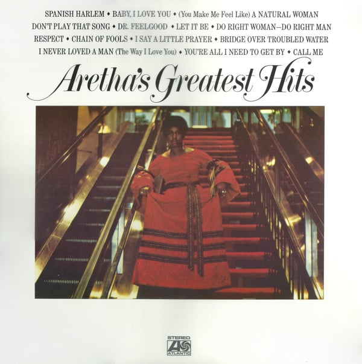

<!-- section break -->

1. Spanish Harlem (3:30)
2. Chain Of Fools (2:45)
3. Don't Play That Song (2:48)
4. I Say A Little Prayer (3:30)
5. Dr. Feelgood (3:18)
6. Let It Be (3:28)
7. Do Right Woman - Do Right Man (3:15)
8. Bridge Over Troubled Water (5:31)
9. Respect (2:26)
10. Baby I Love You (2:39)
11. (You Make Me Feel LIke) A Natural Woman (2:39)
12. I Never Loved A Man (The Way I Love You) (2:47)
13. You're All I Need To Get By (3:34)
14. Call Me (3:18)

<!-- section break -->

## Videos
### Chain of Fools by Aretha Franklin REMASTERED
 

### More Videos

- [Aretha's Greatest Hits /Atlantic](https://www.youtube.com/watch?v=KuDE2JzHYhU)
- [Aretha Franklin - Spanish Harlem](https://www.youtube.com/watch?v=ax3EJyeKW3M)

## Release Information
|  Key           | Value                                                |
| ---------------| ---------------------------------------------------- |
| Release Year   | 2016                                   |
| Discogs Link   | [Aretha Franklin - Aretha's Greatest Hits](https://www.discogs.com/release/9007937-Aretha-Franklin-Arethas-Greatest-Hits) |
| Label          | Atlantic |
| Format         | Vinyl LP Compilation Reissue |
| Catalog Number | 081227943516 |
