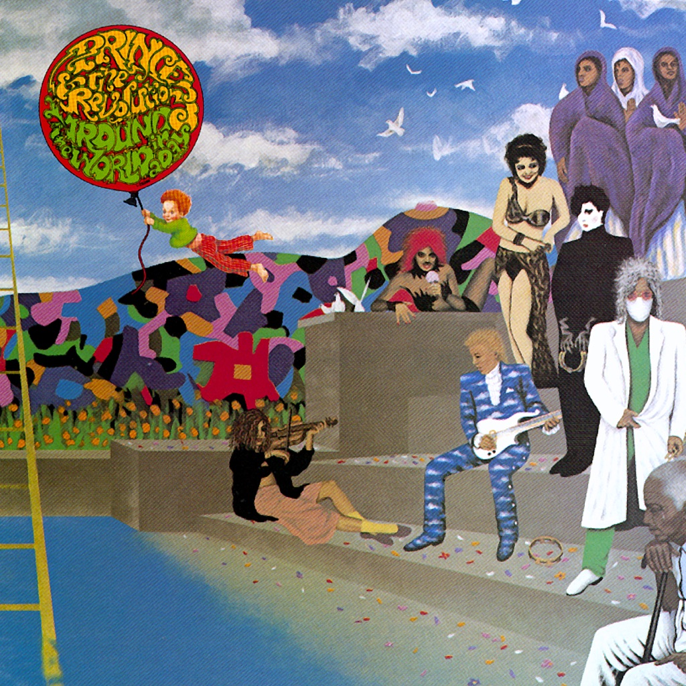

<!-- section break -->

1. Around The World In  A Day (3:30)
2. Paisley Park (4:41)
3. Condition Of The Heart (6:46)
4. Raspberry Beret (3:31)
5. Tamborine (2:53)
6. America (3:40)
7. Pop Life (3:42)
8. The Ladder (5:28)
9. Temptation (8:22)

<!-- section break -->

## Spotify


## Videos
### Prince & The Revolution - Raspberry Beret (Official Music Video)
 

### More Videos

- [Prince & The Revolution - Paisley Park (Official Music Video)](https://www.youtube.com/watch?v=1mhL5ynXzB0)

## Release Information
|  Key           | Value                                                |
| ---------------| ---------------------------------------------------- |
| Release Year   | 2016                                   |
| Discogs Link   | [Prince And The Revolution - Around The World In A Day](https://www.discogs.com/release/9133687-Prince-And-The-Revolution-Around-The-World-In-A-Day) |
| Label          | Paisley Park |
| Format         | Vinyl LP Album Reissue (Gatefold) |
| Catalog Number | 25286-1 |
| Notes | Gatefold sleeve with a perforated flap.   Sealed copies have a sticker on the cellophane wrapping. The sticker features the "Balloon Boy" being carried away. The balloon reads: "Prince And The Revolution Around the World In a Day"  © ℗ 1985 NPG Records, Inc. under exclusive license to Warner Bros. Records, Inc. Manufactured in the E.U. (sleeve: flap)  © ℗ 1985 NPG Records, Inc. under exclusive license to Warner Bros. Records, Inc. Manufactured in the Netherlands (labels)  All songs © 1985 Controversy Music ASCAP.   Tracks A1, A2, A4, A5 & B1 recorded at Paisley Park. Tracks A3 & B2 recorded at Sunset Sound. Track B3 recorded at Mobile Audio. Track B4 recorded at Capitol Records.  Not to be confused with [r=9012810] US Release with a different Manufactured location on sleeve flap. On spine reads "Printed in Canada". |