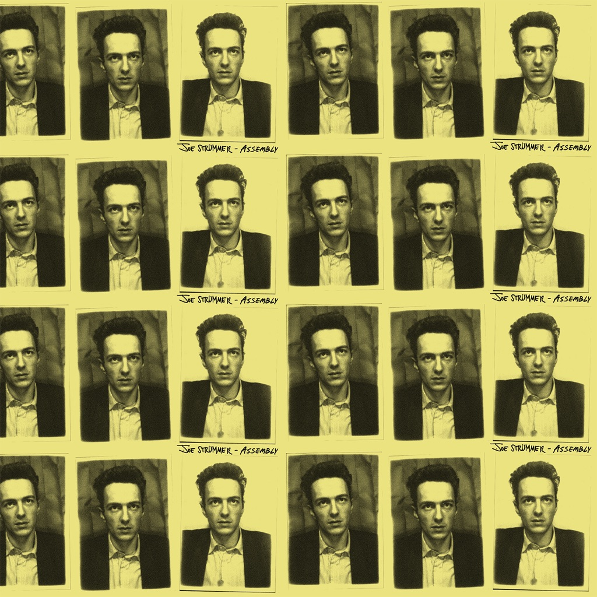

<!-- section break -->

1. Coma Girl
2. Johnny Appleseed
3. I Fought The Law (Live)
4. Tony Adams
5. Sleepwalk
6. Love Kills
7. Get Down Moses
8. X-Ray Style
9. Mondo Bongo
10. Rudie Can't Fail (Live)
11. At The Border, Guy
12. Long Shadow
13. Forbidden City
14. Yalla Yalla
15. Redemption Song
16. Junco Partner (Acoustic)

<!-- section break -->

## Spotify


## Videos
### Sleepwalk
 

### More Videos

- [Joe Strummer - Junco Partner (Acoustic) [Official Video]](https://www.youtube.com/watch?v=V1hsbEUfif8)
- [Joe Strummer - I Fought The Law (Live) [Official Video]](https://www.youtube.com/watch?v=vcMzySHvD_4)
- [Love Kills](https://www.youtube.com/watch?v=LYlTYh71dp0)

## Release Information
|  Key           | Value                                                |
| ---------------| ---------------------------------------------------- |
| Release Year   | 2021                                   |
| Discogs Link   | [Joe Strummer - Assembly](https://www.discogs.com/release/17989276-Joe-Strummer-Assembly) |
| Label          | Dark Horse Records |
| Format         | Vinyl 2× LP Compilation Limited Edition Remastered (Red, 180 Gr) |
| Catalog Number | DH0002 |
| Notes | Some initial purchases came with a free promo limited edition Joe Strummer bandana - in cellophane wrapper with its own barcode.  Early copies from the UK Official Joe Strummer Store came with a free exclusive 12" x 12" litho art print of the front cover artwork (images added).  Tracks are sequentially listed on release. |