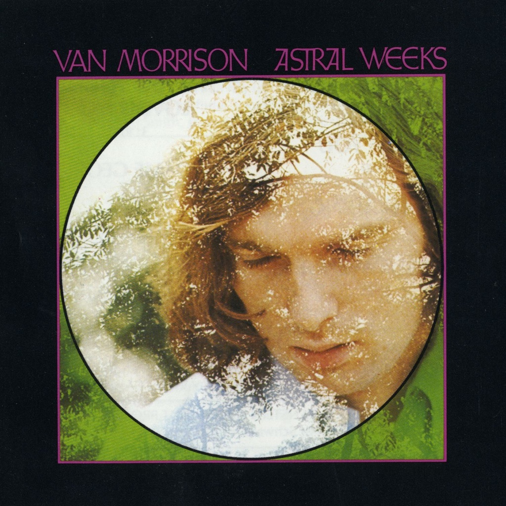

<!-- section break -->

1. Part One: In The Beginning
2. Astral Weeks (7:00)
3. Beside You (5:10)
4. Sweet Thing (4:10)
5. Cyprus Avenue (6:50)
6. Part Two: Afterwards
7. Young Lovers Do (3:10)
8. Madame George (9:25)
9. Ballerina (7:00)
10. Slim Slow Slider (3:20)

<!-- section break -->

## Spotify


## Release Information
|  Key           | Value                                                |
| ---------------| ---------------------------------------------------- |
| Release Year   | 2017                                   |
| Discogs Link   | [Van Morrison - Astral Weeks](https://www.discogs.com/release/10596963-Van-Morrison-Astral-Weeks) |
| Label          | Warner Bros. - Seven Arts Records |
| Format         | Vinyl LP Album Reissue (Clear, 180 g) |
| Catalog Number | 081227937850 |
| Notes | Manufactured In The E.U. Marketed By Rhino Entertainment On Clear Vinyl |