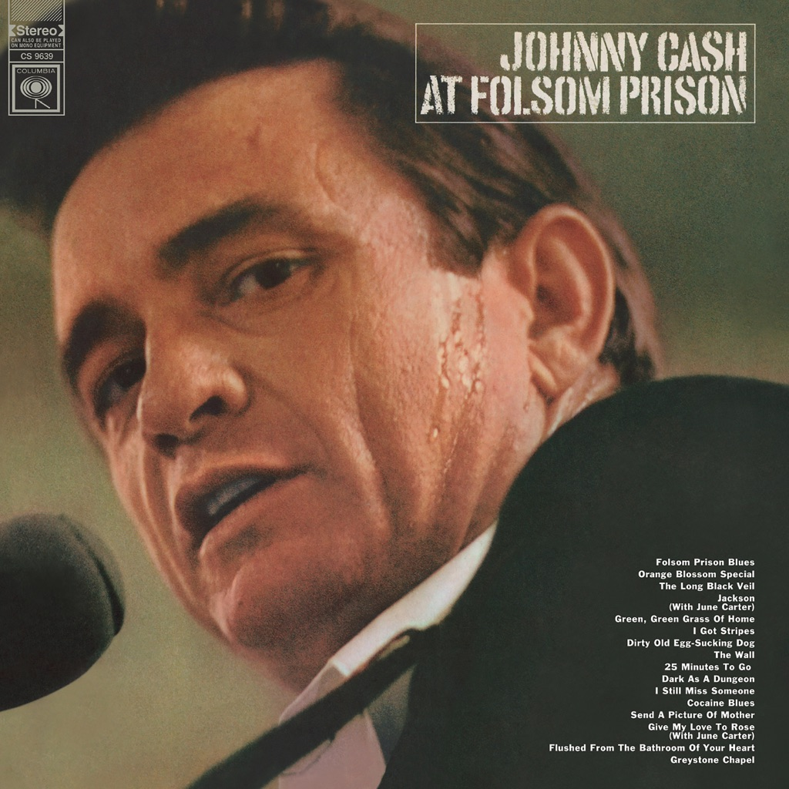

<!-- section break -->

1. Opening Announcements From Hugh Cherry (1:01)
2. Blue Suede Shoes (3:31)
3. This Ole House (1:38)
4. Announcements And Johnny Cash Intro From Hugh Cherry (1:04)
5. Folsom Prison Blues (2:36)
6. Busted (1:24)
7. Dark As A Dungeon (3:07)
8. I Still Miss Someone (1:36)
9. Cocaine Blues (2:49)
10. 25 Minutes To Go (2:57)
11. I'm Here To Get My Baby Out Of Jail (2:22)
12. Orange Blossom Special (3:36)
13. The Long Black Veil (3:43)
14. Send A Picture Of Mother (2:10)
15. The Wall (1:54)
16. Dirty Old Egg-Sucking Dog (1:17)
17. Flushed From The Bathroom Of Your Heart (2:24)
18. Joe Bean (2:30)
19. Jackson (3:28)
20. I Got A Woman (4:37)
21. The Legend Of John Henry's Hammer (7:06)
22. June's Poem (0:58)
23. Green, Green Grass Of Home (3:19)
24. Greystone Chapel (2:49)
25. Closing Announcements (1:46)

<!-- section break -->

## Spotify


## Release Information
|  Key           | Value                                                |
| ---------------| ---------------------------------------------------- |
| Release Year   | 2015                                   |
| Discogs Link   | [Johnny Cash - At Folsom Prison](https://www.discogs.com/release/7467817-Johnny-Cash-At-Folsom-Prison) |
| Label          | Columbia |
| Format         | Vinyl 2× LP Album (180g, Gatefold) |
| Catalog Number | 88875111971 |
| Notes | Expanded Vinyl Edition Includes a download-voucher and a 16 page booklet.  Full, unedited and uncensored concert at Folsom Prison.  All tracks recorded live January 13, 1968 at Folsom Prison.  Originally released in 1968. All rights reserved by Sony Music Entertainment Inc. © 1968, 2015 Sony Music Entertainment./ Distributed by Sony Music Entertainment./ Made in the EU. Sony Music Entertainment International Services GmbH, PO Box 510, 33311 Gütersloh, Germany. |