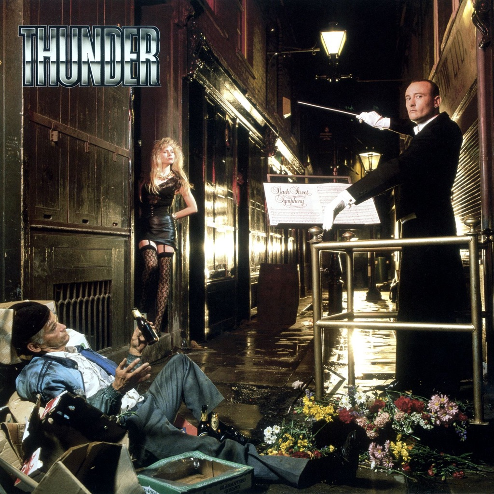

<!-- section break -->

1. She's So Fine
2. Dirty Love
3. Don't Wait For Me
4. Higher Ground
5. Until My Dying Day
6. Back Street Symphony
7. Love Walked In
8. An Englishman On Holiday
9. Girl's Going Out Of Her Head
10. Gimme Some Lovin'
11. Distant Thunder
12. She's So Fine (Live At Marquee London, 2002)
13. Until My Dying Day (Live At Marquee London, 2002)
14. Gimme Some Lovin' (Live At Nottingham Rock City, 2008)

<!-- section break -->

## Videos
### Thunder- Backstreet Symphony (album version)
 

### More Videos

- [Thunder - She's so fine](https://www.youtube.com/watch?v=RprKusE4DF8)
- [Thunder - Love Walked In](https://www.youtube.com/watch?v=R-VVfcnvpAA)

## Release Information
|  Key           | Value                                                |
| ---------------| ---------------------------------------------------- |
| Release Year   | 2023                                   |
| Discogs Link   | [Thunder - Back Street Symphony](https://www.discogs.com/release/26910992-Thunder-Back-Street-Symphony) |
| Label          | BMG |
| Format         | Vinyl LP Album Limited Edition Reissue (Gold), Vinyl LP Album Limited Edition Reissue (Silver) |
| Catalog Number | BMGCAT708DLP |
| Notes | Tracks D1 and D2 Previously available on the 2003 DVD, 'Live & Uncut' on STC Records. Long since deleted and have never been available on CD, vinyl or digital Track D3 Previously only available on The Xmas Show Live 2008 CD given to ticket holders only. Long deleted and has never been on vinyl or digital.  Some copies came with a limited edition art card. |