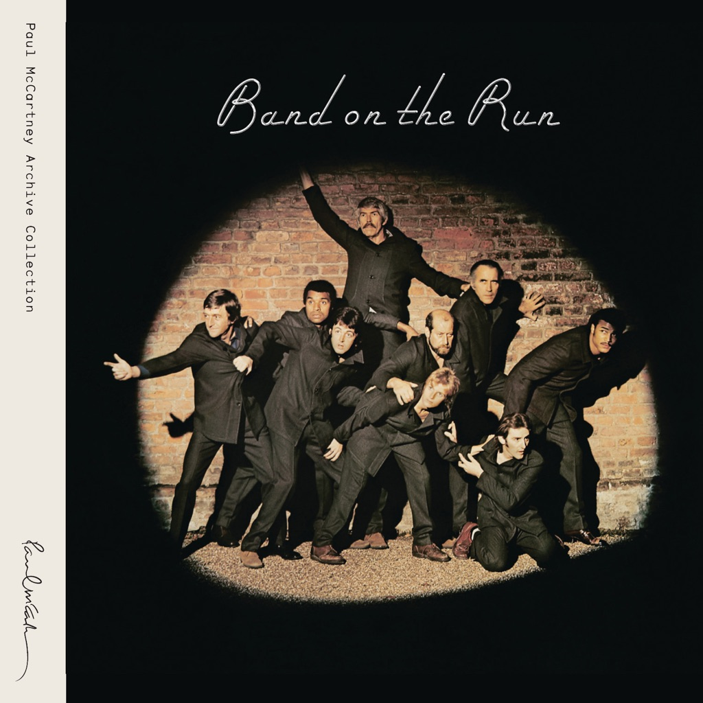

<!-- section break -->

1. Band On The Run (5:12)
2. Jet (4:09)
3. Bluebird (3:23)
4. Mrs. Vandebilt (4:40)
5. Let Me Roll It (4:51)
6. Mamunia (4:51)
7. No Words (2:35)
8. Picasso's Last Words (Drink To Me) (5:49)
9. Nineteen Hundred And Eighty Five (5:28)

<!-- section break -->

## Videos
### Picasso’s Last Words (Drink to Me)
 

### More Videos

- [Mrs. Vandebilt (Remastered 2010)](https://www.youtube.com/watch?v=aIh6UdXTBFs)
- [Let Me Roll It (Remastered 2010)](https://www.youtube.com/watch?v=ly_G9QBX_f0)
- [Band On The Run (Remastered 2010)](https://www.youtube.com/watch?v=RjlvdcBAKdg)
- [Paul McCartney & Wings - Band On The Run (European Reissue CD) (Made In Japan)](https://www.youtube.com/watch?v=SDUvH8Qi2Sg)
- [Jet (Remastered 2010)](https://www.youtube.com/watch?v=zyRDkSVGZ_4)
- [Bluebird (Remastered 2010)](https://www.youtube.com/watch?v=crV239HtBiY)
- [Mamunia (Remastered 2010)](https://www.youtube.com/watch?v=-UAKKR_Mr4o)
- [No Words (Remastered 2010)](https://www.youtube.com/watch?v=rD9BxqgkWns)
- [Nineteen Hundred And Eighty Five (Remastered 2010)](https://www.youtube.com/watch?v=M9L0Y9VbZG0)

## Release Information
|  Key           | Value                                                |
| ---------------| ---------------------------------------------------- |
| Release Year   | 1973                                   |
| Discogs Link   | [Wings - Band On The Run](https://www.discogs.com/release/778278-Paul-McCartney-And-Wings-Band-On-The-Run) |
| Label          | Apple Records |
| Format         | Vinyl LP Album Stereo |
| Catalog Number | PAS 10007 |
| Notes | Includes large fold-out poster depicting many small photographs.  Inner sleeve has picture on one side and lyrics on the other side.  Also available on cassette and cartridge. ℗ 1973 EMI Records Ltd.  An Apple Record.  This version of the release has 3 corners cut on the inner sleeve. Looking at the lyrics side of the inner sleeve, both top corners are cut and so is the bottom right corner. This presentation differs from other releases. |