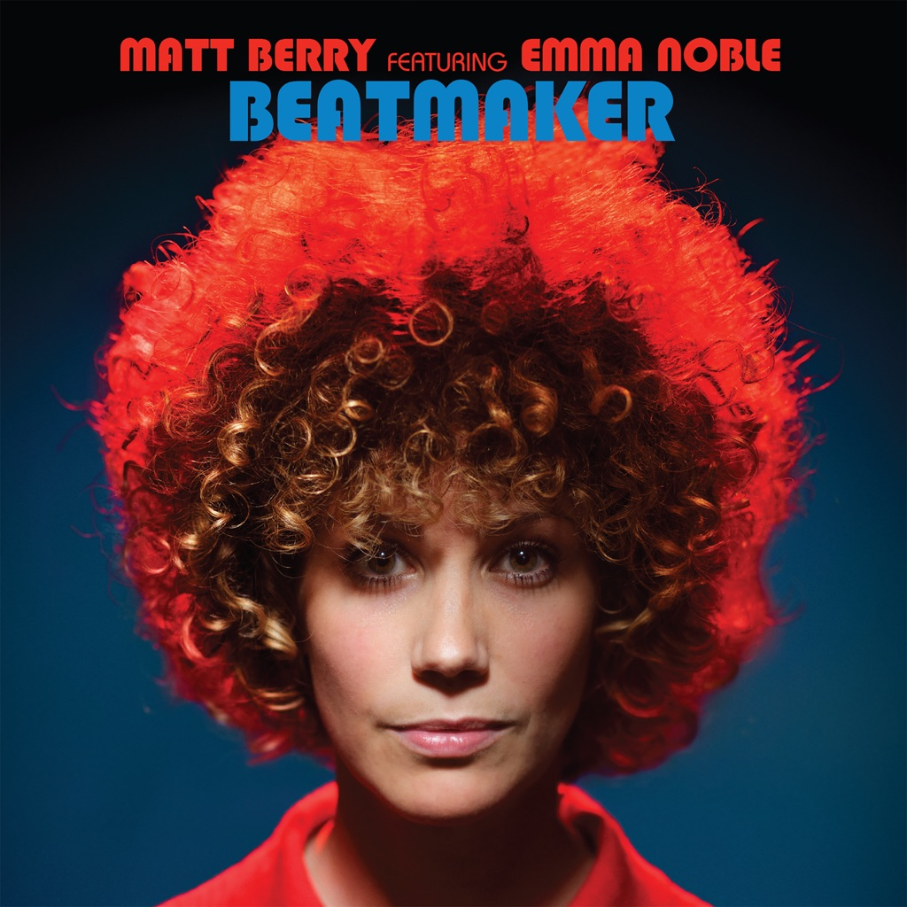

<!-- section break -->

1. Beatmaker
2. Beatmaker (Instrumental)

<!-- section break -->

## Videos
### Beatmaker
 

## Release Information
|  Key           | Value                                                |
| ---------------| ---------------------------------------------------- |
| Release Year   | 2022                                   |
| Discogs Link   | [Matt Berry - Beatmaker](https://www.discogs.com/release/22444114-Matt-Berry-3-Featuring-Emma-Noble-Beatmaker) |
| Label          | Acid Jazz |
| Format         | Vinyl 7" 45 RPM Single Limited Edition Stereo |
| Catalog Number | AJX635S |
| Notes | Originally slated release date 25/03/2022 as per https://mattberry.bandcamp.com Brought forward to 11/03/2022  (nb: Some online customers received their orders earlier than the official release date)  Sleeve notes: Mastered by Mike Thorne at Rimshot Studios. Brass recorded by Sir Tristan Longworth at Chicken Shack Studios.  'Beatmaker' was originally released in 1970 by Doris (see: '[r=1506115]') |