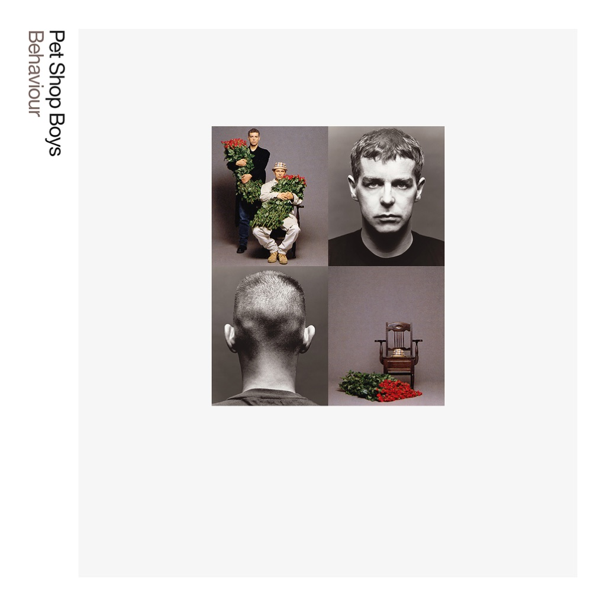

<!-- section break -->

1. Being Boring (6:48)
2. This Must Be The Place I Waited Years To Leave (5:30)
3. To Face The Truth (5:33)
4. How Can You Expect To Be Taken Seriously? (3:55)
5. Only The Wind (4:19)
6. My October Symphony (5:17)
7. So Hard (3:59)
8. Nervously (4:07)
9. The End Of The World (4:41)
10. Jealousy (4:47)

<!-- section break -->

## Spotify


## Release Information
|  Key           | Value                                                |
| ---------------| ---------------------------------------------------- |
| Release Year   | 2018                                   |
| Discogs Link   | [Pet Shop Boys - Behaviour.](https://www.discogs.com/release/12452776-Pet-Shop-Boys-Behaviour) |
| Label          | Parlophone |
| Format         | Vinyl LP Album Reissue Remastered (180g) |
| Catalog Number | 0190295821746 |
| Notes | [Sticker on shrinkwrap:] Pressed onto 180g heavyweight vinyl featuring a brand new 2018 remaster of the original album  [From back cover:] ℗ 2018 Pet Shop Boys Partnership Ltd. under exclusive licence to Parlophone Records Ltd. A Warner Music Group Company © 2018 Pet Shop Boys Partnership Ltd. under exclusive licence to Parlophone Records Ltd. A Warner Music Group Company. All rights reserved. Made in the EU.  [From inner sleeve:] Recorded at Red Deer, München, and Sarm West, London. Orchestra and strings recorded at Abbey Road.  Tracks listed sequentially on back cover and labels. Optimal credit extrapolated from runout data. |