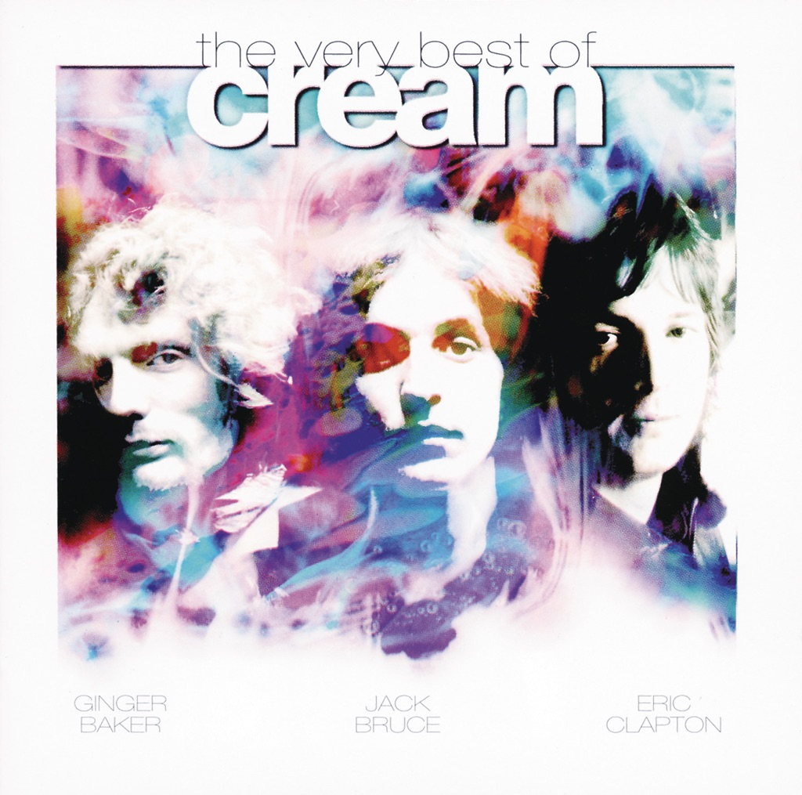

<!-- section break -->

1. Sunshine Of Your Love (4:08)
2. Badge (2:45)
3. Crossroads (4:13)
4. White Room (3:04)
5. Swlabr (2:31)
6. Born Under A Bad Sign (3:08)
7. Spoonful (6:31)
8. Tales Of Brave Ulysses (2:50)
9. Strange Brew (2:45)
10. I Feel Free (2:48)

<!-- section break -->

## Spotify


## Release Information
|  Key           | Value                                                |
| ---------------| ---------------------------------------------------- |
| Release Year   | 1969                                   |
| Discogs Link   | [Cream - Best Of Cream](https://www.discogs.com/release/7244667-Cream-Best-Of-Cream) |
| Label          | Polydor |
| Format         | Vinyl LP Compilation Stereo (Laminated) |
| Catalog Number | 583 060 |
| Notes | Laminated sleeve with plain inner sleeve  Crossroads was recorded live at the Fillmore Auditorium in San Francisco  I Feel Free is a Robert Stigwood Organization (London) Production All other selections were produced by Felix Pappalardi By arrangement with Robert Stigwood  Publishers: A1, A4, A5, B3 to B5 by Dratleaf A2 by Dratleaf/Apple  A3 by Immediate B1 by Tee Pee B2 by Jewel  Manufactured by Polydor Records Ltd., London  Made in England  ℗ 1966 - B5 ℗ 1967 - A1, A5, B3, B4 ℗ 1968 - A3, A4, B1, B2 ℗ 1969 - A2  Runouts are stamped |