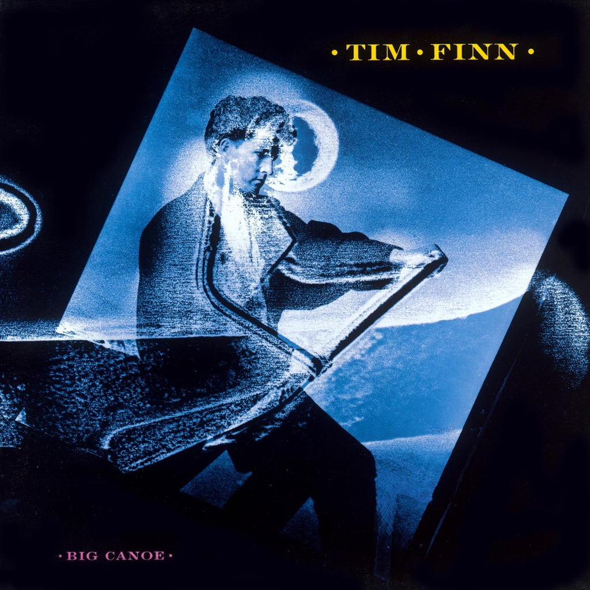

<!-- section break -->

1. Spiritual Hunger
2. Don't Bury My Heart
3. Timmy
4. So Deep
5. No Thunder, No Fire, No Rain
6. Carve You In Marble
7. Water Into Wine
8. Hyacinth
9. Big Canoe
10. Are We One Or Are We Two

<!-- section break -->

## Spotify


## Videos
### Carve You in Marble.mp4
 

### More Videos

- [TIM FINN - No Thunder, No Fire, No Rain (1986)](https://www.youtube.com/watch?v=V7140SlRUQE)
- [Tim Finn - Spiritual Hunger (1986)](https://www.youtube.com/watch?v=GGVNSZowmT8)

## Release Information
|  Key           | Value                                                |
| ---------------| ---------------------------------------------------- |
| Release Year   | 1986                                   |
| Discogs Link   | [Tim Finn - Big Canoe](https://www.discogs.com/release/2529922-Tim-Finn-Big-Canoe) |
| Label          | Virgin |
| Format         | Vinyl LP Album |
| Catalog Number | V2369 |
| Notes | This version differs from [url=http://www.discogs.com/release/1877272]another similar release[/url] in that it lacks "Manufactured in the U.K." anywhere on the release.    Printed inner sleeve with lyrics and credits  No country of release displayed on packaging or labels.    Outer sleeve:  ℗ 1986 VIRGIN RECORDS  © 1986 VIRGIN RECORDS    Inner sleeve:  Recorded and Mixed at Townhouse Studios 2 & 3    Labels:  ℗ 1986 Virgin Records Ltd.  VIRGIN IS A TRADE MARK OF VIRGIN HOLDINGS LTD.   |