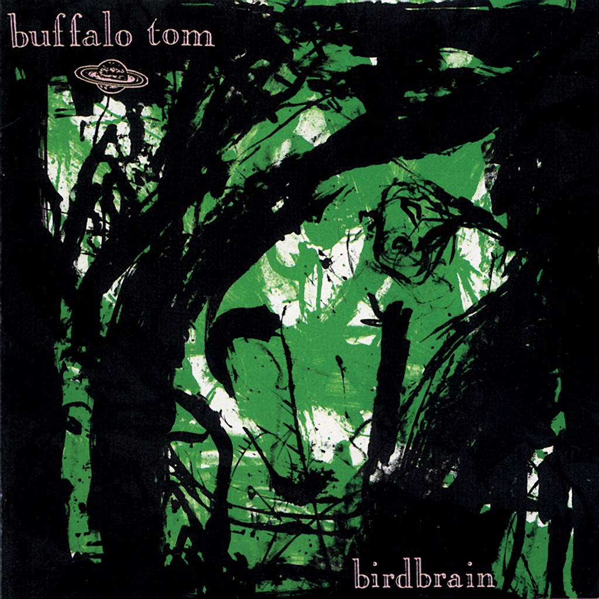

<!-- section break -->

1. Birdbrain (3:13)
2. Skeleton Key (4:35)
3. Caress (2:41)
4. Guy Who Is Me (3:04)
5. Enemy (4:53)
6. Crawl (3:53)
7. Fortune Teller (3:16)
8. Baby (3:32)
9. Directive (4:01)
10. Bleeding Heart (3:11)

<!-- section break -->

## Spotify


## Videos
### Buffalo Tom - Birdbrain
 

### More Videos

- [Buffalo Tom - Crawl](https://www.youtube.com/watch?v=MNd9RYJMt6k)

## Release Information
|  Key           | Value                                                |
| ---------------| ---------------------------------------------------- |
| Release Year   | 2020                                   |
| Discogs Link   | [Buffalo Tom - Birdbrain](https://www.discogs.com/release/16016550-Buffalo-Tom-Birdbrain) |
| Label          | Beggars Arkive |
| Format         | Vinyl LP Album Limited Edition Reissue (Mint Green) |
| Catalog Number | BBQ2179LP |
| Notes | Published by Scrawny Music Licensed from Megadisc Records, Belgium ℗ 1990 Megadisc Records © 2020 Beggars Banquet Records Ltd.  30th anniversary pressing.  Hype Sticker 'Limited Edition featuring mint green colored vinyl" |