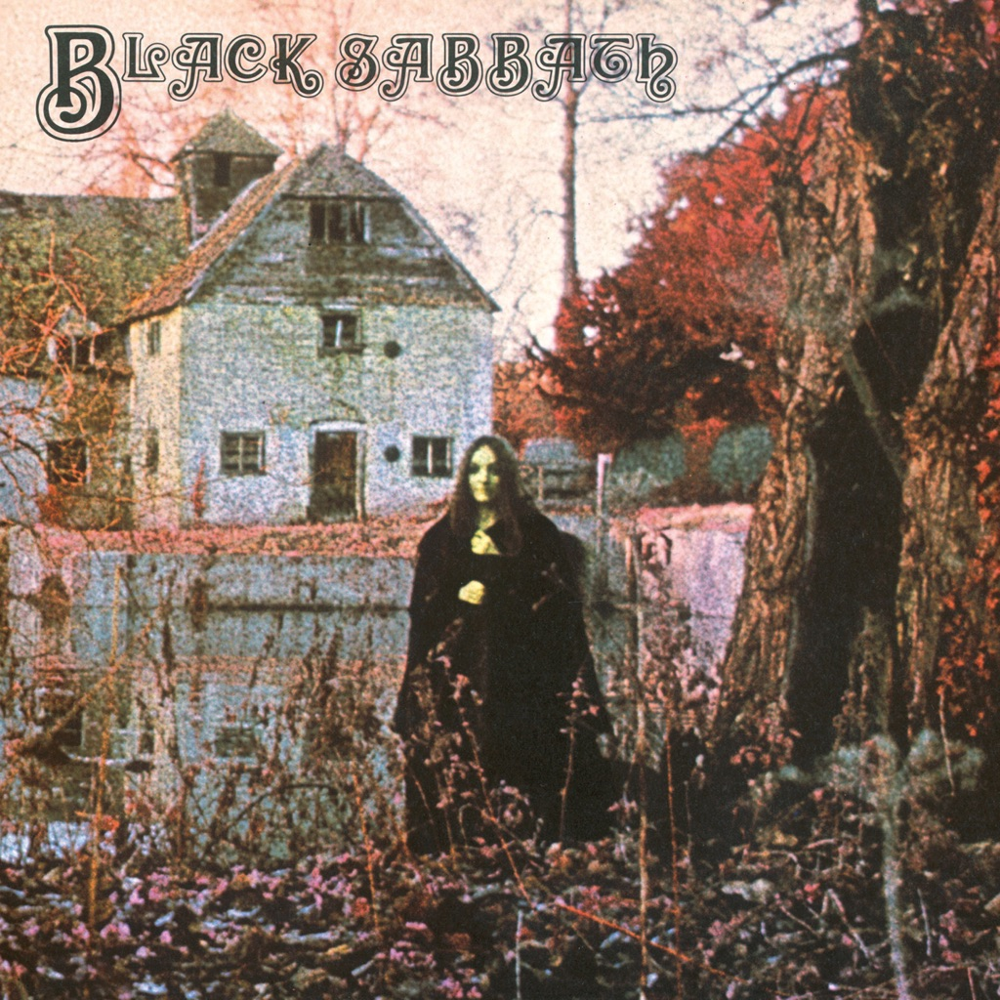

<!-- section break -->

1. Black Sabbath (6:20)
2. The Wizard (4:22)
3. Wasp / Behind The Wall Of Sleep / Bassically / N.I.B. (9:44)
4. Wicked World (4:30)
5. A Bit Of Finger / Sleeping Village / Warning (14:32)

<!-- section break -->

## Spotify


## Videos
### Black Sabbath  Behind the Wall of Sleep  (Studio Outtake)
 

### More Videos

- [BLACK SABBATH - Black Sabbath (Official Video)](https://www.youtube.com/watch?v=0lVdMbUx1_k)
- [Black Sabbath   First Album   Full Ripped vinyl](https://www.youtube.com/watch?v=tkjqN8j_PSI)
- [Black Sabbath - Black Sabbath | (Black Sabbath, 1970) | [HQ]](https://www.youtube.com/watch?v=ISXnYu-Or4w)
- [The Wizard (2009 - Remaster)](https://www.youtube.com/watch?v=ftKNGzh7t94)
- [Behind the Wall of Sleep (2009 - Remaster)](https://www.youtube.com/watch?v=D5Du4BhqE14)
- [Evil Woman, Don't Play Your Games with Me (2009 - Remaster)](https://www.youtube.com/watch?v=1A5a_GlYo0g)
- [Sleeping Village (2009 - Remaster)](https://www.youtube.com/watch?v=Za4YaV1x_dw)
- [Warning (2009 - Remaster)](https://www.youtube.com/watch?v=kkGQBKZpjHA)

## Release Information
|  Key           | Value                                                |
| ---------------| ---------------------------------------------------- |
| Release Year   | 2010                                   |
| Discogs Link   | [Black Sabbath - Black Sabbath](https://www.discogs.com/release/2270277-Black-Sabbath-Black-Sabbath) |
| Label          | Rhino Records (2) |
| Format         | Vinyl LP Album Reissue Stereo (180 Gram) |
| Catalog Number | R1 1871 |
| Notes | 180 gram black vinyl Rhino reissue, cut from the original analog masters.  This release is very similar to the 1970 Warner Bros. Records release [r=2011391]. "Rhino Vinyl" is only mentioned in a small font on the vinyl labels. The reissue year 2010 is not visible anywhere; only 1970. Record housed in plain poly-lined inner sleeve. Barcode appears only on hype sticker.  Jacket is Tip-On.  Made in U.S.A. on labels. Printed in U.S.A. on spine.  This release is not to be confused with the nearly identical [r=7286544] which has different center labels. |