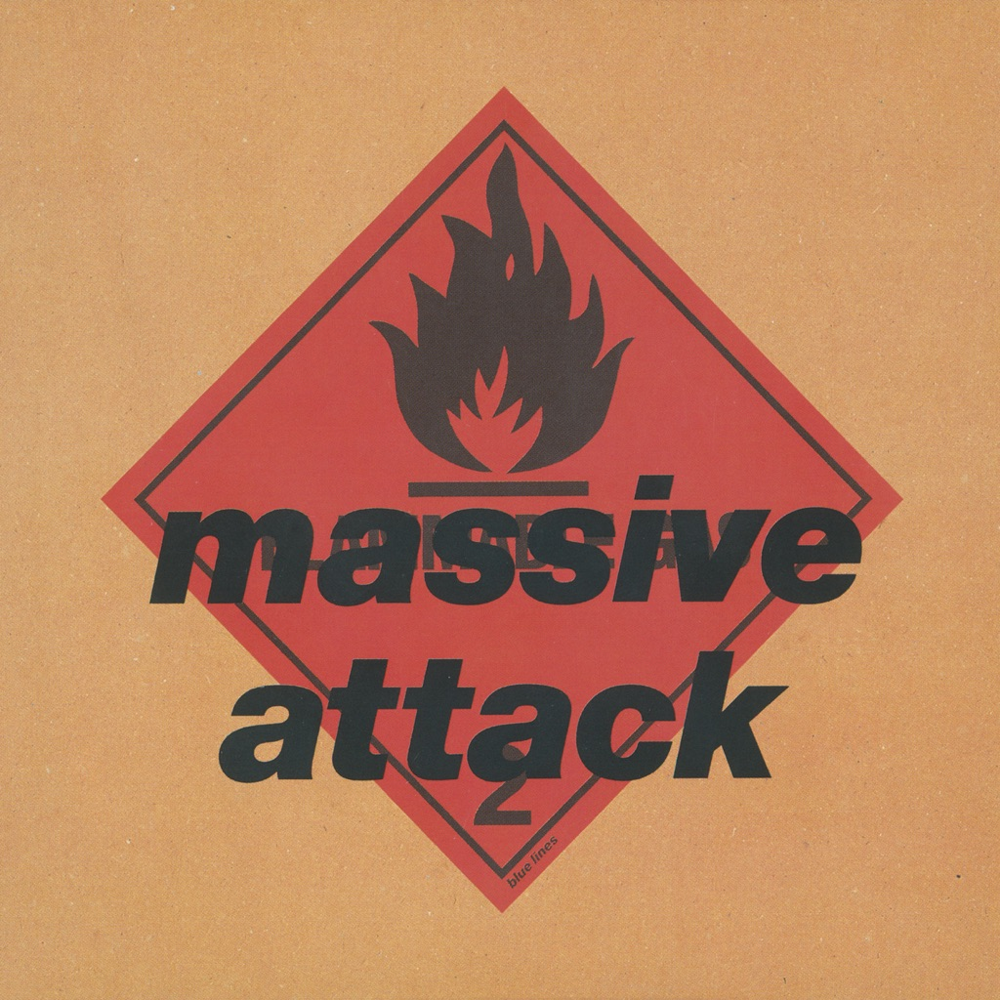

<!-- section break -->

1. Safe From Harm (5:16)
2. One Love (4:48)
3. Blue Lines (4:21)
4. Be Thankful For What You've Got (4:09)
5. Five Man Army (6:04)
6. Unfinished Sympathy (5:08)
7. Daydreaming (4:14)
8. Lately (4:26)
9. Hymn Of The Big Wheel (6:36)

<!-- section break -->

## Spotify


## Release Information
|  Key           | Value                                                |
| ---------------| ---------------------------------------------------- |
| Release Year   | 2016                                   |
| Discogs Link   | [Massive Attack - Blue Lines](https://www.discogs.com/release/9442778-Massive-Attack-Blue-Lines) |
| Label          | Virgin |
| Format         | Vinyl LP Album Reissue Stereo (180 gram) |
| Catalog Number | 5700960 |
| Notes | Reissue. Comes with a printed inner sleeve with lyrics, credits and photos. Some copies came with a download card.  On labels: Made in EU   |