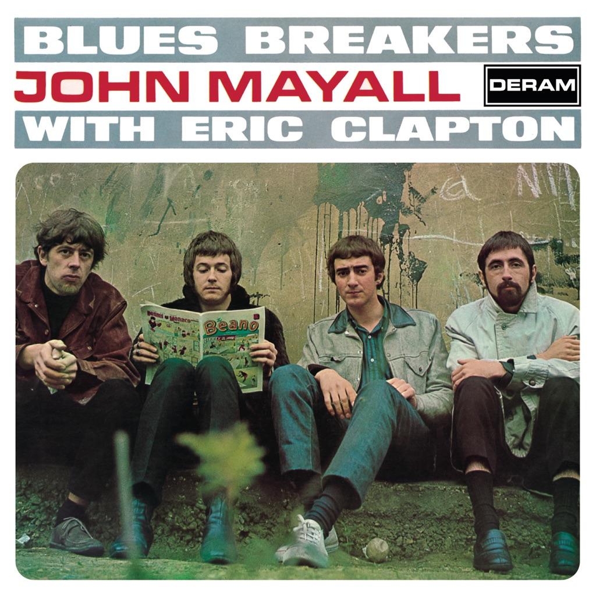

<!-- section break -->

1. All Your Love (3:35)
2. Hideaway (3:14)
3. Little Girl (2:33)
4. Another Man (1:44)
5. Double Crossing Time (3:02)
6. What'd I Say (4:26)
7. Key To Love (2:06)
8. Parchman Farm (2:19)
9. Have You Heard (5:44)
10. Ramblin' On My Mind (3:07)
11. Steppin' Out (2:28)
12. It Ain't Right (2:41)

<!-- section break -->

## Spotify


## Release Information
|  Key           | Value                                                |
| ---------------| ---------------------------------------------------- |
| Release Year   | 2016                                   |
| Discogs Link   | [John Mayall - Blues Breakers](https://www.discogs.com/release/8987135-John-Mayall-With-Eric-Clapton-Blues-Breakers) |
| Label          | Decca |
| Format         | Vinyl LP Album Reissue Repress Mono (180 Gram) |
| Catalog Number | 0042280008611 |
| Notes | Repress of [r4292610], but, in this release no limited edition and remastering mentioned anywhere  ℗ & © 1966 The Decca Record Company Limited, London, A Universal Music Company  Recorded At The Decca Studios No. 2, West Hampstead, London. April 1966. 180 gram Remastered Limited Edition Includes A Voucher To Download MP3 Version Of The Album. Issued as part of the 'Back To Black 60th Vinyl Anniversary' series The MP3 downloads include both the mono and stereo mixes.  |