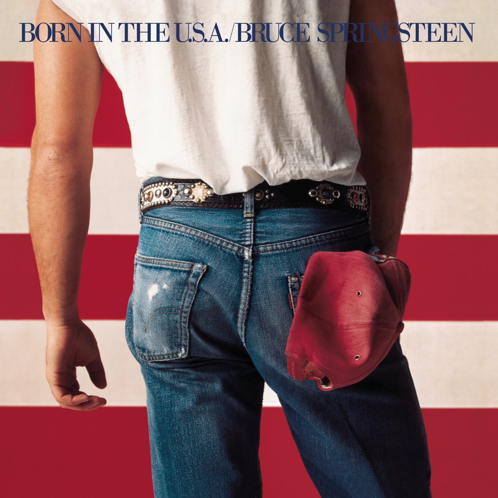

<!-- section break -->

1. Born In The U.S.A. (4:39)
2. Cover Me (3:26)
3. Darlington County (4:48)
4. Working On The Highway (3:11)
5. Downbound Train (3:35)
6. I'm On Fire (2:36)
7. No Surrender (4:00)
8. Bobby Jean (3:46)
9. I'm Goin' Down (3:29)
10. Glory Days (4:15)
11. Dancing In The Dark (4:01)
12. My Hometown (4:33)

<!-- section break -->

## Spotify


## Videos
### I'm Goin' Down
 

### More Videos

- [Bruce Springsteen - Born in the U.S.A. (Official Video)](https://www.youtube.com/watch?v=EPhWR4d3FJQ)
- [Bruce Springsteen - Dancing In the Dark (Official Video)](https://www.youtube.com/watch?v=129kuDCQtHs)
- [Cover Me](https://www.youtube.com/watch?v=s3tqIk8TPWM)
- [Darlington County](https://www.youtube.com/watch?v=1t5JvmqTx94)
- [Working on the Highway](https://www.youtube.com/watch?v=5OEA9_Gtims)
- [Downbound Train](https://www.youtube.com/watch?v=2WPJT6VZxlo)
- [I'm On Fire](https://www.youtube.com/watch?v=1VxFS5-klfk)
- [No Surrender](https://www.youtube.com/watch?v=txKhQ9cbhgo)
- [Bobby Jean](https://www.youtube.com/watch?v=iGR_Rk74tOk)
- [Glory Days](https://www.youtube.com/watch?v=GLBnj159q3s)
- [My Hometown](https://www.youtube.com/watch?v=KrGi8ODOWR0)

## Release Information
|  Key           | Value                                                |
| ---------------| ---------------------------------------------------- |
| Release Year   | 1984                                   |
| Discogs Link   | [Bruce Springsteen - Born In The U.S.A.](https://www.discogs.com/release/1551256-Bruce-Springsteen-Born-In-The-USA) |
| Label          | CBS |
| Format         | Vinyl LP Album Stereo (Sunburst Label) |
| Catalog Number | CBS 86304 |
| Notes | This album comes with printed inner sleeve with pics and credits, a lyrics sheet and an overview of Bruce Springsteen "All The Music".  Some copies come without the overview insert. Some copies have a sticker, there are at least 4 different possible stickers.  On back cover : © 1984 Bruce Springsteen / ℗ 1984 Bruce Springsteen Made in Holland. Distribution CBS Records / CBS Disques S.A.  On lyrics insert : All songs © 1984 Bruce Springsteen (ASCAP)  On inner sleeve (credits side) : © 1984 Bruce Springsteen 01-086304-20  On labels : ℗ 1984 Bruce Springsteen Made in Holland  Runouts description:  Everything is hand-etched except 'MASTERDISK' is stamped On variant 7 'C 0I_86304_3A_I' (side A) is stamped |