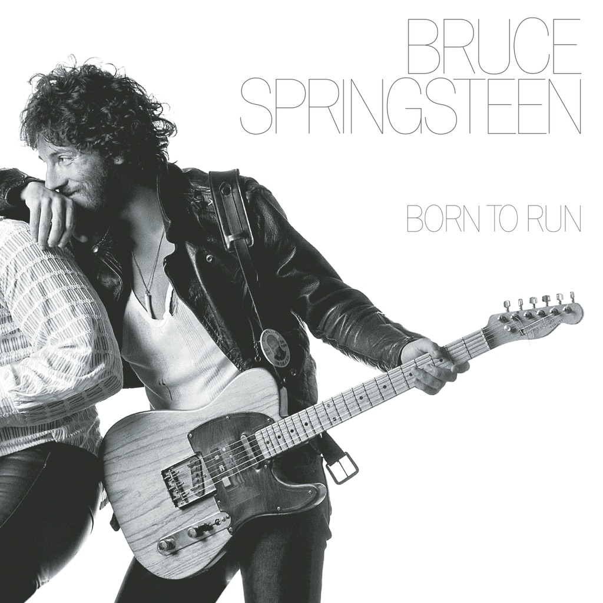

<!-- section break -->

1. Thunder Road (4:50)
2. Tenth Avenue Freeze-Out (3:11)
3. Night (3:01)
4. Backstreets (6:29)
5. Born To Run (4:30)
6. She's The One (4:30)
7. Meeting Across The River (3:16)
8. Jungleland (9:33)

<!-- section break -->

## Spotify


## Videos
### Night
 

### More Videos

- [Thunder Road](https://www.youtube.com/watch?v=W2X0Gf9jfz8)
- [Tenth Avenue Freeze-Out](https://www.youtube.com/watch?v=LOkQsVJV8ts)
- [Backstreets](https://www.youtube.com/watch?v=USQ697oqkaw)
- [Born to Run](https://www.youtube.com/watch?v=Wu4_zVxmufY)
- [She's the One](https://www.youtube.com/watch?v=blbFaatKszE)
- [Meeting Across the River](https://www.youtube.com/watch?v=c6OAtvjSf1Y)
- [Jungleland](https://www.youtube.com/watch?v=l6IwxpL-ZDk)

## Release Information
|  Key           | Value                                                |
| ---------------| ---------------------------------------------------- |
| Release Year   | 1975                                   |
| Discogs Link   | [Bruce Springsteen - Born To Run](https://www.discogs.com/release/1663765-Bruce-Springsteen-Born-To-Run) |
| Label          | CBS |
| Format         | Vinyl LP Album Misprint Stereo (Gatefold) |
| Catalog Number | S 69170 |
| Notes | Jon Landau's name is misspelled "John" on the bottom of the back cover.  Randy Brecker and Michael Brecker appear courtesy of Arista Records. David Sancious appears courtesy of Epic Records. Dave Sanborn appears courtesy of Warner.  Recorded, mixed, and mastered at Record Plant Studio, New York, N.Y. Track B1, 'Recorded at 914 Sound Studio, Blauvelt, N.Y.' Cover made by 'Interpak by Shorewood Packaging Co. Ltd. England' Cat. # is 69170 on the cover, S 69170 on the label and runout. Black and white photo of the artist on left hand inside cover, song lyrics on both inside covers.  Label information: Made in England 1-4 Intersong Music Ltd. (both labels) Additional catalogue # (PC33795) ℗ 1975 CBS Inc.  Publishing information:  All selections © 1975 Laurel Canyon Music Ltd. except "Born To Run," © 1974 Laurel Canyon Music Ltd. Used by permission. All rights reserved. Assigned for UK to Intersong Music Ltd.  Very special thanks for their patience and help to Roy Cicala and Susan Palmer at Record Plant, N.Y., Columbia Records and Sam McKeith, William Morris Agency.  All Matrix/Runouts are Etched - Variants 1, 6, 7. All Matrix/Runouts are Stamped - Variants 3 to 5. Matrix/Runouts are Not Known (no information provided) - Variant 2.     |