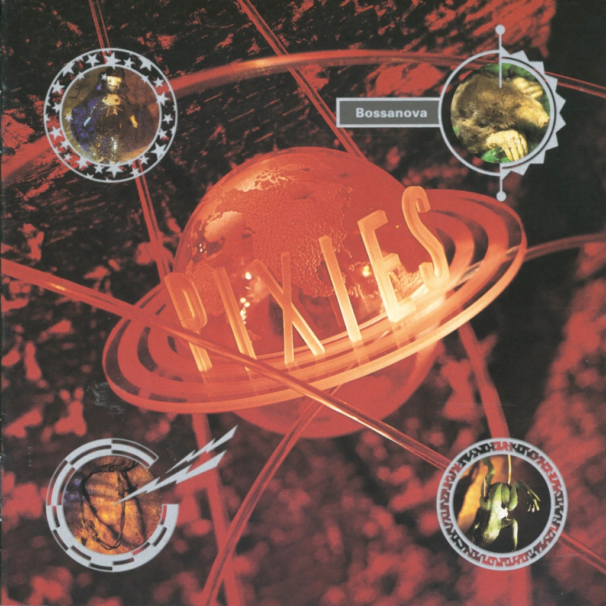

<!-- section break -->

1. Cecilia Ann
2. Rock Music
3. Velouria
4. Allison
5. Is She Weird
6. Ana
7. All Over The World
8. Dig For Fire
9. Down To The Well
10. The Happening
11. Blown Away
12. Hang Wire
13. Stormy Weather
14. Havalina

<!-- section break -->

## Spotify


## Release Information
|  Key           | Value                                                |
| ---------------| ---------------------------------------------------- |
| Release Year   | 2020                                   |
| Discogs Link   | [Pixies - Bossanova](https://www.discogs.com/release/15709017-Pixies-Bossanova) |
| Label          | 4AD |
| Format         | Vinyl LP Album Limited Edition Reissue (Red Translucent) |
| Catalog Number | 4AD 0265 LPX |
| Notes | 30th Anniversary Limited Red Vinyl Edition includes Original Booklet.  The booklet previously only available in the UK release. |