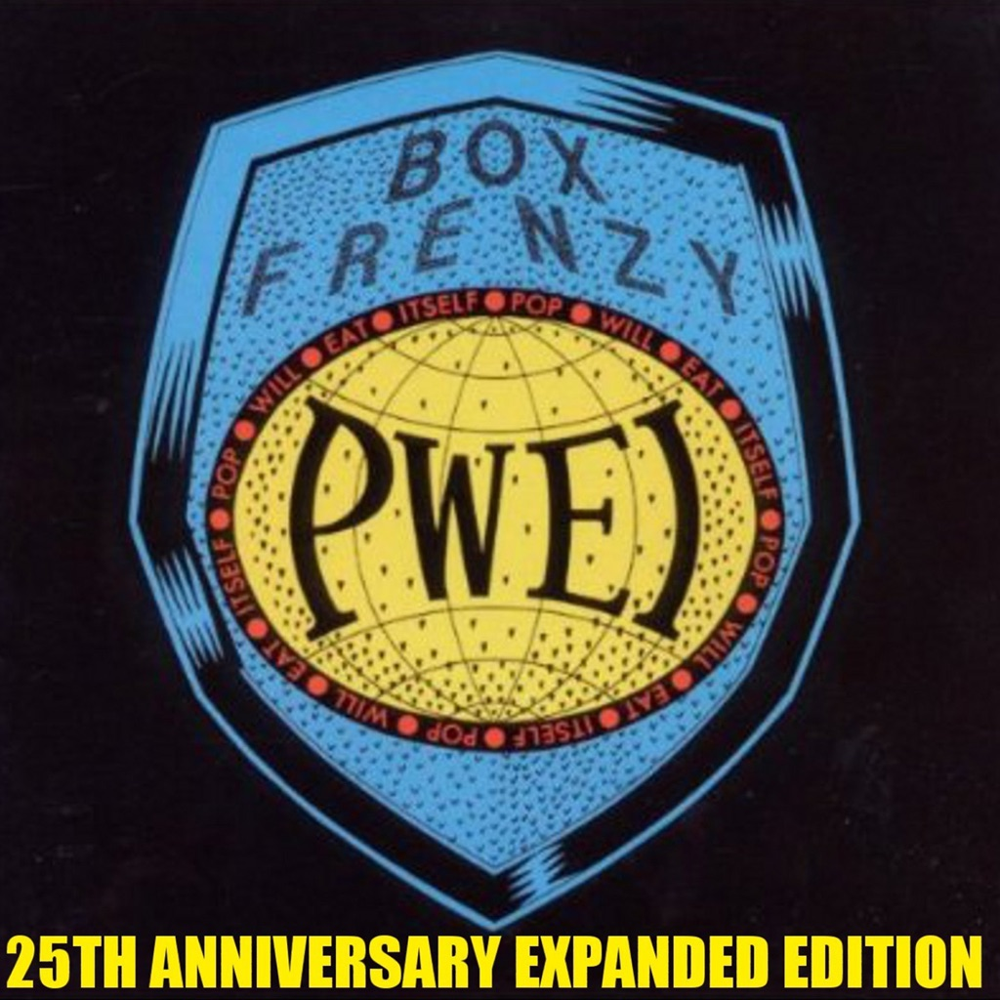

<!-- section break -->

1. Grebo Guru (3:56)
2. Beaver Patrol (3:08)
3. Let's Get Ugly (4:00)
4. U.B.L.U.D. (3:49)
5. Inside You (2:37)
6. Evelyn (3:16)
7. There Is No Love Between Us Anymore (3:55)
8. She's Surreal (4:08)
9. Intergalactic Love Mission (3:53)
10. Love Missile F1-11 (4:10)
11. Hit The Hi-Tech Groove (5:10)
12. Razorblade Kisses (1:49)

<!-- section break -->

## Spotify


## Videos
### Pop Will Eat Itself  hit the hi tech groove
 

### More Videos

- [Pop Will Eat Itself - There Is No Love Between Us Anymore (Video)](https://www.youtube.com/watch?v=hWhwXhpiMMU)
- [Pop Will Eat Itself - Love Missile F1 - 11](https://www.youtube.com/watch?v=EBuNUk4J2jk)
- [Pop Will Eat Itself - Go Box Frenzy - Let's Get Ugly](https://www.youtube.com/watch?v=k2jzNd_pm8U)
- [Pop Will Eat Itself ~ Razorblade Kisses](https://www.youtube.com/watch?v=78hI6JDfJVw)
- [Pop Will Eat Itself ~ Evelyn](https://www.youtube.com/watch?v=8rw9hgPMkEY)

## Release Information
|  Key           | Value                                                |
| ---------------| ---------------------------------------------------- |
| Release Year   | 1987                                   |
| Discogs Link   | [Pop Will Eat Itself - Box Frenzy](https://www.discogs.com/release/72193-Pop-Will-Eat-Itself-Box-Frenzy) |
| Label          | Chapter 22 |
| Format         | Vinyl LP Album |
| Catalog Number | CHAP LP 18 |
| Notes | Produced at Fon Studios, Sheffield.  Includes printed inner sleeve with lyrics and credits on one side. The other side features an adaptation of an advert (taken from a comic) titled 'The Insult That Made A Man Out Of 'Mac''. A-side identified as Front Side, B-side as Back Side (sleeve and labels).  ℗ 1987 Chapter 22 Records © 1987 Chapter 22 Records  Made in England  Mastered at The Townhouse. Pressed at MPO Averton.  Distributed in the UK by Nine Mile/Cartel  |