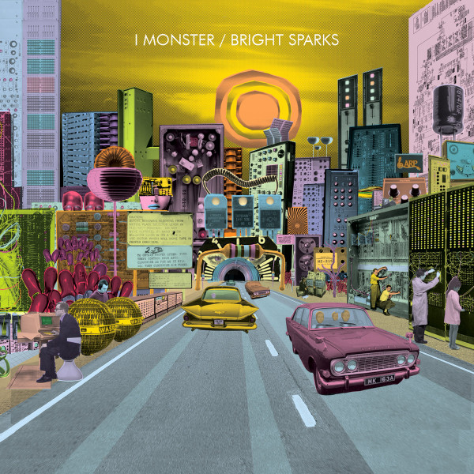

<!-- section break -->

1. The Fantastic Tale Of Dr. Moog And The Birth Of The Shimmering Beast (5:19)
2. The Uncertain Contents Of The Buchla Box (6:01)
3. Alan R. Pearlman And The ARPiological Exploration Of The Cosmos (6:17)
4. The Ballad Of Harry Chamberlain And The Surreptitious Window Cleaner (4:56)
5. The Bradley Brothers Realise The Transmutation Of The Chamberlain To The Mellotron (4:37)
6. London, 1969 - The Wizards Of Putney Deny Accusations Of Unholy Enchantment At The Electronic Music Studios (EMS) (5:13)
7. Electronic Dream Plant (EDP) - The Dirt In The Ointment (3:50)
8. The Further Adventures Of K. Freeman And His Incredible Machine Of A Thousand Strings (5:08)

<!-- section break -->

## Spotify


## Videos
### I Monster - The Fantastic Tale of Dr. Moog and the Birth of the Shimmering Beast
 

## Release Information
|  Key           | Value                                                |
| ---------------| ---------------------------------------------------- |
| Release Year   | 2016                                   |
| Discogs Link   | [I Monster - Bright Sparks](https://www.discogs.com/release/8200654-I-Monster-Bright-Sparks) |
| Label          | Twins Of Evil |
| Format         | Vinyl LP Album (Gatefold Sleeve) |
| Catalog Number | BIGTOELP2 |
