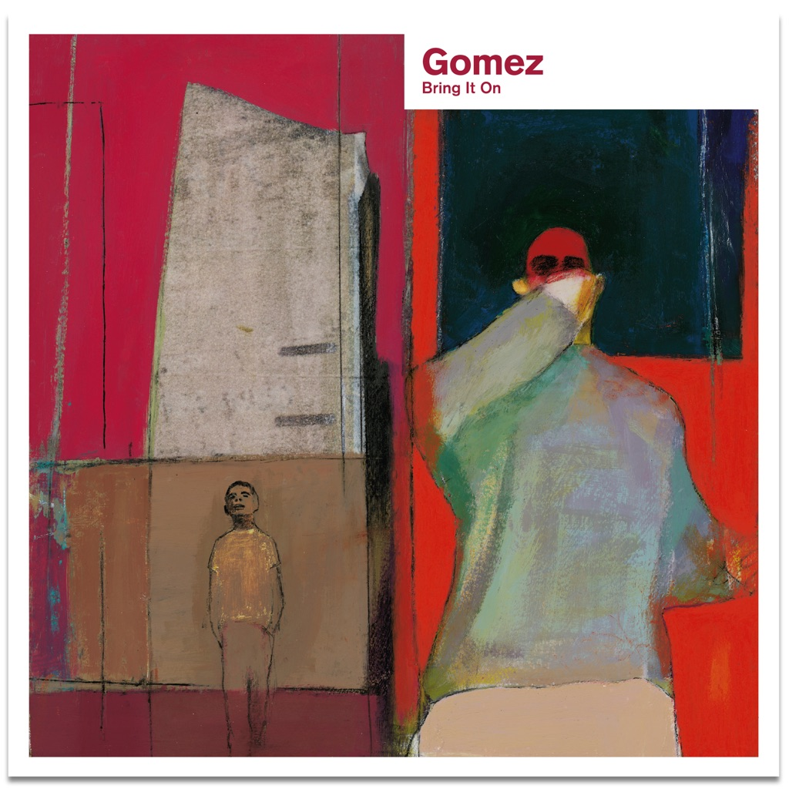

<!-- section break -->

1. Get Miles (5:15)
2. Whippin' Piccadilly (3:12)
3. Make No Sound (3:26)
4. 78 Stone Wobble (4:22)
5. Tijuana Lady (7:08)
6. Here Comes The Breeze (5:29)
7. Love Is Better Than A Warm Trombone (3:29)
8. Get Myself Arrested (4:04)
9. Free To Run (4:31)
10. Bubble Gum Years (3:20)
11. Rie's Wagon (9:07)
12. The Comeback (0:44)

<!-- section break -->

## Spotify


## Videos
### Gomez - Tijuana Lady
 

### More Videos

- [Gomez - Get Miles Vinyl Rip from Bring It On (1998)](https://www.youtube.com/watch?v=eMtfb1j5sw0)
- [Get Miles](https://www.youtube.com/watch?v=8hEFQsqWhUQ)
- [Gomez - Bring It On](https://www.youtube.com/watch?v=F2vJBaq6zlE)

## Release Information
|  Key           | Value                                                |
| ---------------| ---------------------------------------------------- |
| Release Year   | 2018                                   |
| Discogs Link   | [Gomez - Bring It On](https://www.discogs.com/release/11890384-Gomez-Bring-It-On) |
| Label          | UMC |
| Format         | Vinyl LP (Burgundy), Vinyl LP (Yellow), All Media Album Limited Edition Reissue Remastered |
| Catalog Number | 6711417 |
| Notes | 20th Anniversary reissue. Unipack envelope sleeve.   Limited edition burgundy and yellow coloured vinyl. Includes printed inner sleeves and a download code.  First catalogue number on spine, second on hype sticker.   |