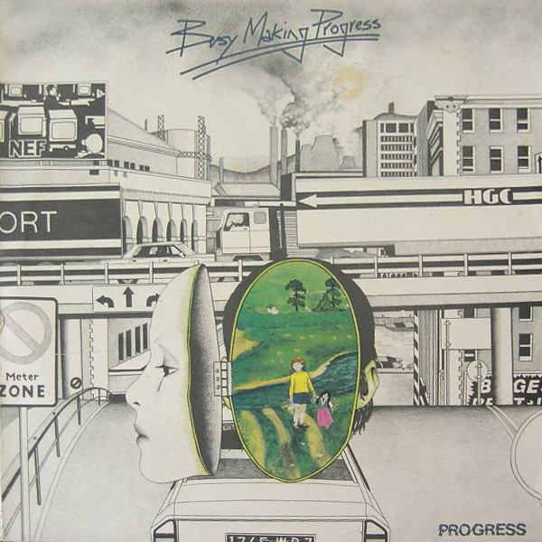

<!-- section break -->

1. Vision (3:05)
2. There Is A Light (4:10)
3. Payday (0:45)
4. Busy Making Progress (2:55)
5. When You Go (4:25)
6. Protoplasmic Crud (3:25)
7. Stop And Think (2:50)
8. Is It Worth The Price (3:40)
9. A Long Long Way To Go ..... (3:00)
10. Changing The Face Of The Earth (5:45)

<!-- section break -->

## Videos
### Michael Cassidy / There is a Light / Beyond Illusion
 

### More Videos

- [Busy Making Progress LP 1978 FULL ALBUM Remasterd By B v d M 2014](https://www.youtube.com/watch?v=WJbw8dobg0c)

## Release Information
|  Key           | Value                                                |
| ---------------| ---------------------------------------------------- |
| Release Year   | 1978                                   |
| Discogs Link   | [Progress - Busy Making Progress](https://www.discogs.com/release/920716-Progress-Busy-Making-Progress) |
| Label          | Sudarshan Disc |
| Format         | Vinyl LP Album Stereo |
| Catalog Number | BBT 111 |
| Notes | This is a special benefit album. All the artists who contributed to its production did so without remuneration.  Special thanks to Carlos Santana, Bob Dylan, George Harrison, Neil Diamond, Bob Marley, Stevie Wonder and Alice Coltrane for their inspiration and help with ISKCON projects.  On labels: ℗ © 1978, Sudarshan Disc On sleeve: © Golden Lotus Productions 1978 |