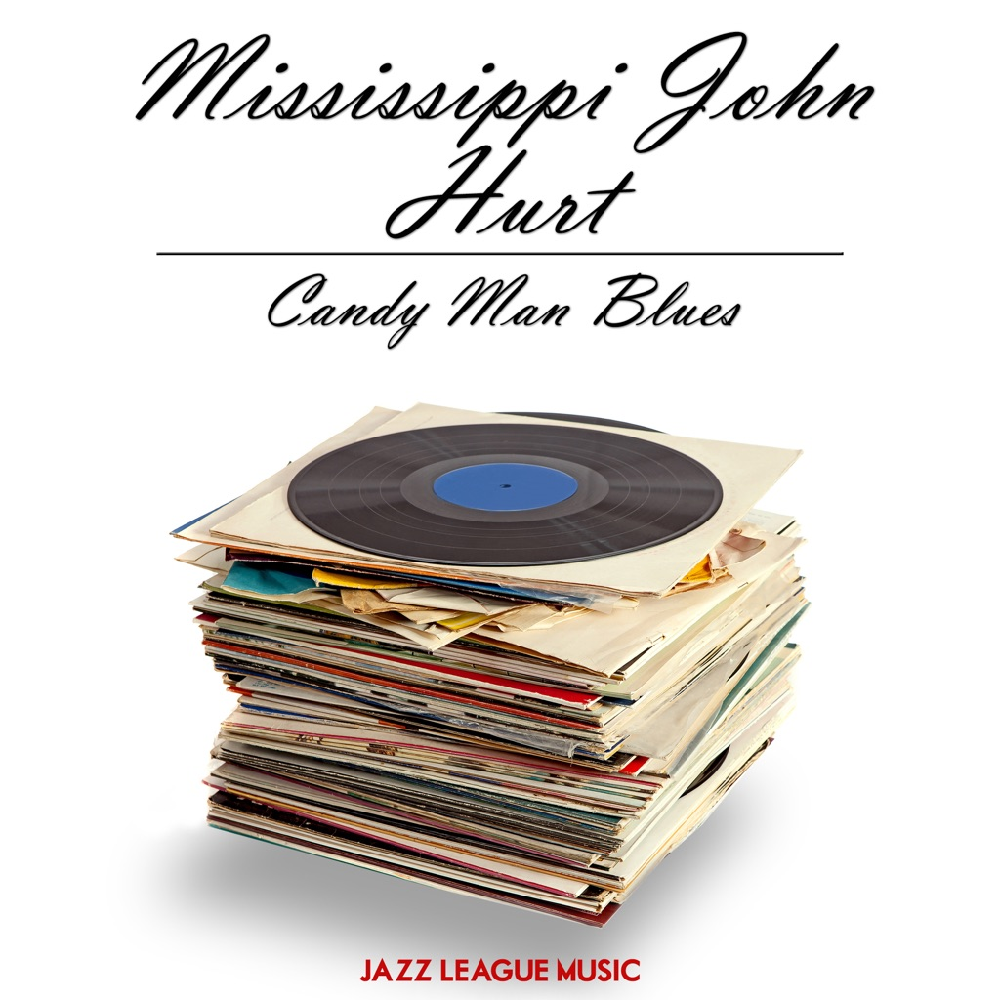

<!-- section break -->

1. Frankie
2. Louis Collins
3. Nobody's Dirty Business
4. Ain't No Tellin'
5. Stack O' Lee
6. Avalon Blues
7. Big Leg Blues
8. Praying On The Old Camp Ground
9. Candy Man Blues
10. Blessed Be Thy Name
11. Blue Harvest Blues
12. Spike Driver Blues
13. Got The Blues (Can't Be Satisfied)

<!-- section break -->

## Spotify


## Videos
### Avalon blues - The complete 1928 okeh recordings (full album)
 

## Release Information
|  Key           | Value                                                |
| ---------------| ---------------------------------------------------- |
| Release Year   | 2013                                   |
| Discogs Link   | [Mississippi John Hurt - Candy Man Blues](https://www.discogs.com/release/5078542-Mississippi-John-Hurt-Candy-Man-Blues) |
| Label          | Complete Blues |
| Format         | Vinyl LP Compilation (Blue) |
| Catalog Number | SBLUELP010 |
| Notes | A1, A3 Recorded Memphis, Tenn. 14 Feb 1928  A2, A4, A6, B1 Recorded New York City 21 Dec 1928  A5, B2 to B7 Recorded New York City 28 Dec 1928 |