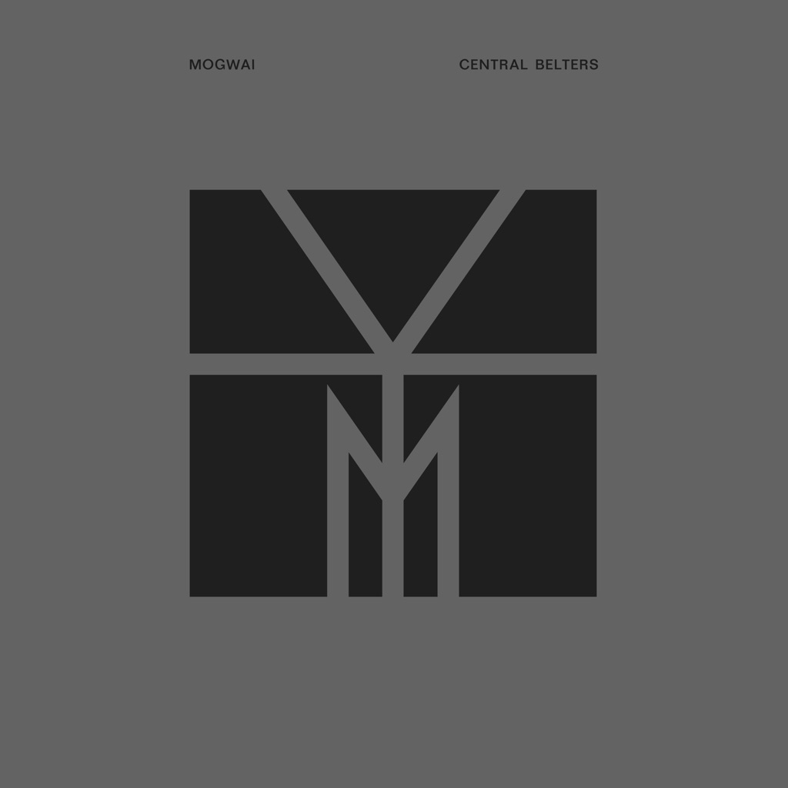

<!-- section break -->

1. Summer
2. New Paths To Helicon Part 1
3. Cody
4. Christmas Steps
5. I Know You Are But What Am I?
6. Hunted By A Freak
7. Stanley Kubrick
8. Take Me Somewhere Nice
9. 2 Rights Make 1 Wrong
10. Mogwai Fear Satan
11. Auto Rock
12. Travel Is Dangerous
13. Friend Of The Night
14. We're No Here
15. I'm Jim Morrison, I'm Dead
16. The Sun Smells Too Loud
17. Batcat
18. Mexican Grand Prix
19. Rano Pano
20. How To Be A Werewolf
21. Wizard Motor
22. Remurdered
23. The Lord Is Out Of Control
24. Teenage Exorcists
25. Hugh Dallas
26. Half Time
27. Burn Girl Prom Queen
28. Devil Rides
29. Hasenheide
30. Tell Everybody That I Love Them
31. Earth Division
32. Hungry Face
33. D To E
34. My Father My King

<!-- section break -->

## Videos
### D to E
 

### More Videos

- [Tell Everyone That I love Them](https://www.youtube.com/watch?v=yfsTXfiZi_k)
- [How To Be A Werewolf](https://www.youtube.com/watch?v=qCbymPWCzds)
- [Earth Division](https://www.youtube.com/watch?v=CAoLNBPU9mo)
- [Teenage Exorcists](https://www.youtube.com/watch?v=i2hbDzSCPO0)

## Release Information
|  Key           | Value                                                |
| ---------------| ---------------------------------------------------- |
| Release Year   | 2015                                   |
| Discogs Link   | [Mogwai - Central Belters](https://www.discogs.com/release/7631730-Mogwai-Central-Belters) |
| Label          | Rock Action Records |
| Format         | Vinyl 6× LP, Box Set Compilation Limited Edition |
| Catalog Number | ROCKACT100LP |
| Notes | Sticker on box:    "Central Belters:  A Mogwai Retrospective    Heavyweight 6xLP set including  album tracks, singles and rarities  1995 - 2015    Includes digital download coupon"    "This compilation P & C 2015 Rock Action Records"    Disc One:    Published by Chrysalis Music    Tracks 1 & 2 taken from the album "[url=http://www.discogs.com/Mogwai-Ten-Rapid-Collected-Recordings-1996-1997/master/17956]Ten Rapid[/url]"   P&C 1997 Rock Action Records    Tracks 3 & 4 taken from the album "[m=6404]"  P&C 1999 Chemikal Underground Ltd.    Tracks 5 & 6 taken from the album "[m=6427]"  P&C 2003 Play It Again Sam [PIAS]    Disc Two:    Published by Chrysalis Music    Track 1 taken from the " [m=205749]" EP  P&C 2001 Chemikal Underground Ltd.    Tracks 2 & 3 taken from the album "[m=18092]"  P&C 2001 Southpaw Recordings    Track 4 taken from the album "[m=18165]"  P&C 1997 Chemikal Underground Ltd.    Disc Three:    Published by Chrysalis Music    Tracks 1, 2, 3 & 4 taken from the album "[m=18032]"  P&C 2006 Play It Again Sam [PIAS]    Tracks 5, 6 & 7 taken from the album "[m=69192]"  P&C 2008 Wall Of Sound Ltd.    Disc Four:    Track 1 published by Chrysalis Music  Tracks 2 to 7 published by Kobalt Music Publishing/Tomorrow Hits Publishing    Tracks 1, 2 & 3 taken from the album " [m=309320]"  P&C 2011 Rock Action Records    Track 4 taken from the "[m=525093]" OST  P&C 2013 Rock Action Records    Tracks 5 & 6 taken from the album " [m=643358]"  P&C 2014 Rock Action Records    Track 7 taken from the "[m=764273]" EP  P&C 2014 Rock Action Records    Disc Five:    Tracks 1, 2, 3 & 4 published by Chrysalis Music  Track 5 published by Kobalt Music Publishing/Tomorrow Hits Publishing    Track 1 taken from the "[r=5930644]" reissue  P&C 2014 Chemikal Underground Ltd.    Track 2 taken from the "[url=http://www.discogs.com/Mogwai-Zidane/master/18045]Zidane: A 21 st Century Portrait[/url]" OST   P&C 2006 Wall Of Sound Ltd.    Track 3 taken from the "[m=205749]" EP  P&C 2001 Chemikal Underground Ltd.    Track 4 taken from the "[m=69179]" single  P&C 2008 Wall of Sound Ltd.    Track 5 taken from The "[url=http://www.discogs.com]Rano Pano[/url]" single  P&C 2011 Rock Action Records     Disc Six:    Tracks 1, 2 & 3 published by Kobalt Music Publishing/ Tomorrow Hits Publishing  Tracks 4 & 5 published by Chrysalis Music    Track 1 taken from the "[url=http://www.discogs.com/Mogwai-Rave-Tapes-Bonus-7/release/5343006]Tell Everybody That I Love Them[/url]" single   P&C 2014 Rock Action Records    Track 2 appears on the "[r=5776764]" Compilation  P&C 2012 Rock Action Records    Track 3 taken from the "[m=525093]" OST  P&C 2013 Rock Action Records    Track 4 appears on [url=http://www.discogs.com/Mogwai-Bardo-Pond-Mogwai-Bardo-Pond/release/898566]2001 US Tour EP[/url]   P&C 2001 Play It Again Sam [PIAS]    Track 5 taken from the " [m=18006]" one sided single  P&C 2001 Play It Again Sam [PIAS]    "We would like to thank everyone who  submitted setlists, tickets, posters, flyers  and many other items to us that we've  been able to use throughout this booklet."    *Vinyl and CD versions of Central Belters purchased from Monorail Music (Glasgow) came with a postcard set with 5 hand numbered Ordnance Survey postcards from various points in Scotland's central belt, each signed by a member of Mogwai, documenting each of their origins. Postcard set packaged in stamped brown envelope and limited to 100. |