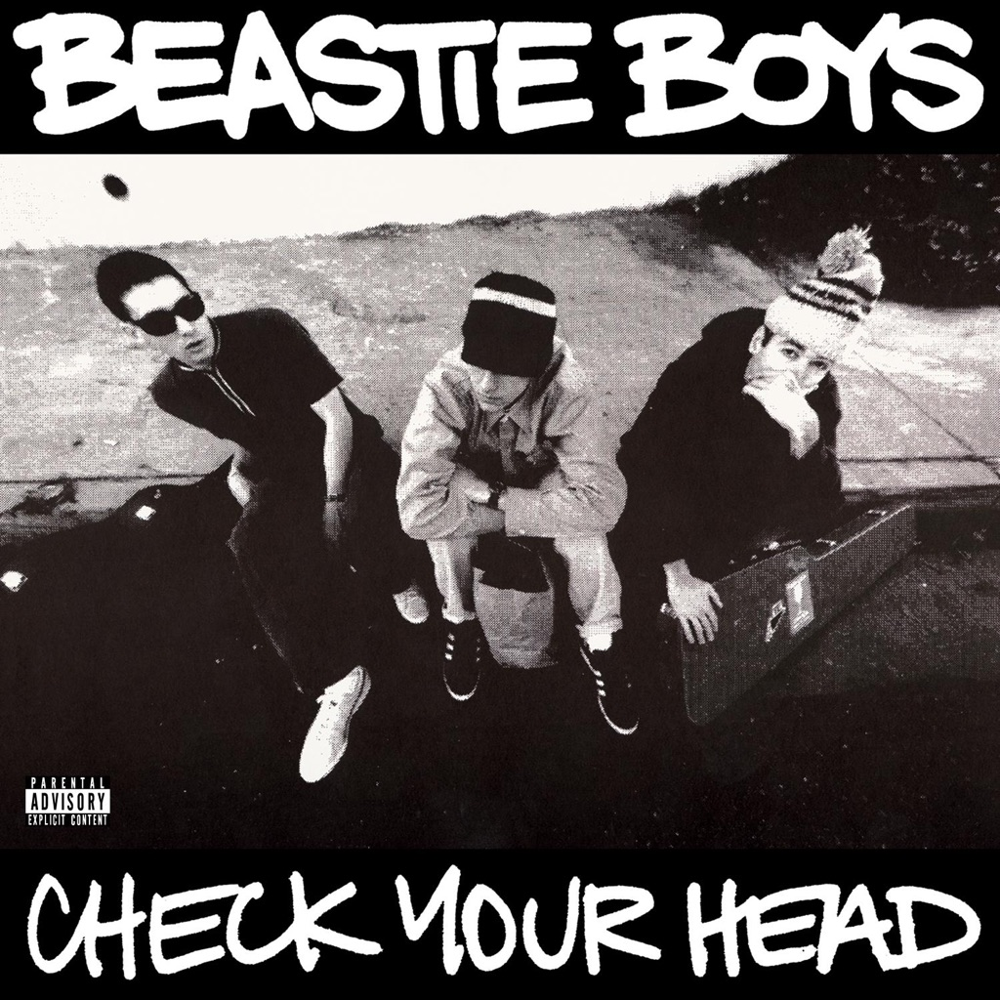

<!-- section break -->

1. Jimmy James (3:14)
2. Funky Boss (1:35)
3. Pass The Mic (4:17)
4. Gratitude (2:45)
5. Lighten Up (2:41)
6. Finger Lickin' Good (3:39)
7. So What'cha Want (3:37)
8. The Biz Vs The Nuge (0:33)
9. Time For Livin' (1:48)
10. Something's Got To Give (3:28)
11. The Blue Nun (0:32)
12. Stand Together (2:47)
13. Pow (2:13)
14. The Maestro (2:52)
15. Groove Holmes (2:33)
16. Live At P.J.'s (3:18)
17. Mark On The Bus (1:05)
18. Professor Booty (4:13)
19. In 3's (2:23)
20. Namasté (4:01)

<!-- section break -->

## Spotify


## Videos
### Beastie Boys - Pass the Mic (Official Music Video)
 

### More Videos

- [Beastie Boys - So What'Cha Want](https://www.youtube.com/watch?v=ru3gH27Fn6E)
- [Beastie Boys - Gratitude](https://www.youtube.com/watch?v=ZdJ5e70Q8mw)
- [Beastie Boys - Something's Got To Give (Official Music Video)](https://www.youtube.com/watch?v=teQqelBTw7g)
- [Beastie Boys - Jimmy James (Official Music Video)](https://www.youtube.com/watch?v=vw5i7TPkYfI)

## Release Information
|  Key           | Value                                                |
| ---------------| ---------------------------------------------------- |
| Release Year   | 2009                                   |
| Discogs Link   | [Beastie Boys - Check Your Head](https://www.discogs.com/release/1729629-Beastie-Boys-Check-Your-Head) |
| Label          | Grand Royal |
| Format         | Vinyl 2× LP Album Reissue Remastered (180 Gram, Gatefold) |
| Catalog Number | C1-94225 |
| Notes | Recorded and mixed at G-Son Studios, Atwater Village, CA Sequenced at PCP Labs Remastered at Sterling Sound, NYC  ℗ and © 1992 Capitol Records, LLC and Beastie Boys  Printed in the EU.  Made in the EU.  This album goes out to David Scilken  |