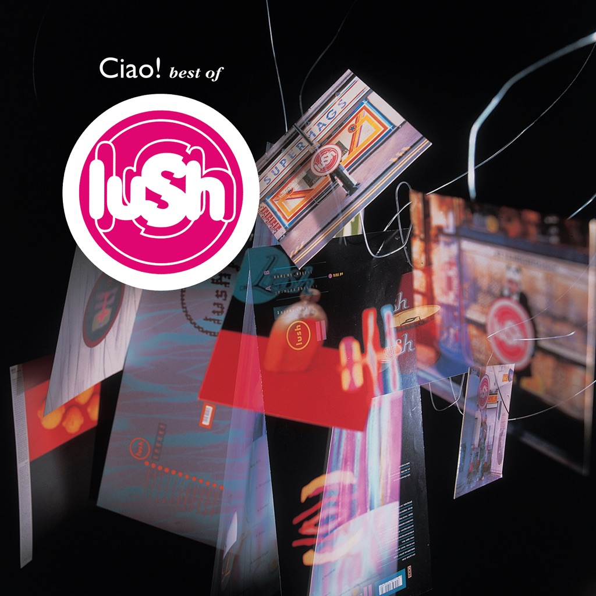

<!-- section break -->

1. Ladykillers
2. Single Girl
3. Ciao!
4. 500 (Shake Baby Shake)
5. Light From A Dead Star
6. Love At First Sight
7. Hypocrite
8. Desire Lines
9. Lovelife
10. When I Die
11. Nothing Natural
12. Untogether
13. For Love
14. Monochrome
15. De-Luxe
16. Sweetness And Light
17. Thoughtforms
18. Etheriel

<!-- section break -->

## Spotify


## Release Information
|  Key           | Value                                                |
| ---------------| ---------------------------------------------------- |
| Release Year   | 2015                                   |
| Discogs Link   | [Lush - Ciao! Best Of Lush](https://www.discogs.com/release/7778678-Lush-Ciao-Best-Of-Lush) |
| Label          | 4AD |
| Format         | Vinyl 2× LP Compilation Limited Edition Reissue (Red) |
| Catalog Number | CAD 2K22 |
| Notes | Released on Record Store Day Black Friday 2015. Comes in a gatefold sleeve.  Dedicated to the memory of [url=https://www.discogs.com/artist/259782-Chris-Acland]Christopher Acland[/url].  A1 to A3 taken from the album [url=http://www.discogs.com/Lush-Lovelife/master/19763]'Lovelife'[/url]. ℗ 1996 4AD Ltd.  A4: single remix, original version on album [url=http://www.discogs.com/Lush-Lovelife/master/19763]'Lovelife'[/url]. ℗ 1996 4AD Ltd.  A5, B2 to C1: taken from the album [url=http://www.discogs.com/Lush-Split/master/19721]'Split'[/url]. ℗ 1994 4AD Ltd.  B1: taken from the single [url=http://www.discogs.com/Lush-Hypocrite/master/6363]'Hypocrite'[/url]. ℗ 1994 4AD Ltd.  C2 to D1: taken from the single album [url=http://www.discogs.com/Lush-Spooky/master/6277]'Spooky'[/url]. ℗ 1992 4AD Ltd.  D2: taken from the single [url=http://www.discogs.com/Lush-Mad-Love/master/19700]'Mad Love'[/url]. ℗ 1990 4AD Ltd.  D3: taken from the single [url=http://www.discogs.com/Lush-Sweetness-And-Light/master/6298]'Sweetness And Light'[/url]. ℗ 1990 4AD Ltd.  D4, D5: taken from the mini album [url=http://www.discogs.com/Lush-Scar/master/6226]'Scar'[/url]. ℗ 1989 4AD Ltd.  This compilation ℗ 2000 4AD Ltd. © 2015 4AD Ltd. |