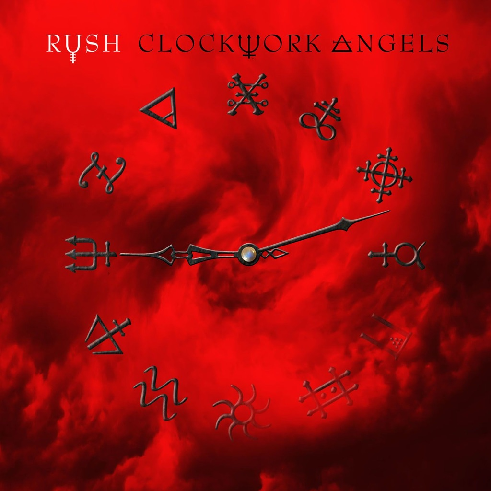

<!-- section break -->

1. Caravan (5:40)
2. BU2B (5:10)
3. Clockwork Angels (7:31)
4. The Anarchist (6:52)
5. Carnies (4:52)
6. Halo Effect (3:14)
7. Seven Cities Of Gold (6:32)
8. The Wreckers (5:01)
9. Headlong Flight (7:20)
10. BU2B2 (1:28)
11. Wish Them Well (5:25)
12. The Garden (6:59)

<!-- section break -->

## Spotify


## Release Information
|  Key           | Value                                                |
| ---------------| ---------------------------------------------------- |
| Release Year   | 2013                                   |
| Discogs Link   | [Rush - Clockwork Angels](https://www.discogs.com/release/4835484-Rush-Clockwork-Angels) |
| Label          | Roadrunner Records |
| Format         | Vinyl 2× LP Album Reissue |
| Catalog Number | RRCAR 7656-1 |
| Notes | Gatefold sleeve. Printed inner sleeves with lyrics.    "Caravan" and "BU2B" recorded at Blackbird Studios, Nashville TN, April 2010  All other songs recorded at Revolution Recording, Toronto ON, October-December 2011  Mixed at Henson Studios, Los Angeles CA, January-March 2012  Strings recorded at Ocean Way Studios, Los Angeles CA, January 18, 2012  "BU2B" new intro recorded on Lerxst Mobile, West Hollywood CA    All songs published by Core Music Publishing (SESAC) for the U.S.A. and Core Music Publishing (SOCAN) for the World excluding the U.S.A.    Licensed to Cargo Records For Vinyl Distribution. © & ℗ 2012 T.Y.S., Inc. for the world excluding Canada. Made in Germany (as stated on back cover and labels)    Also released on [url=http://www.discogs.com/release/4514510]red vinyl[/url] |