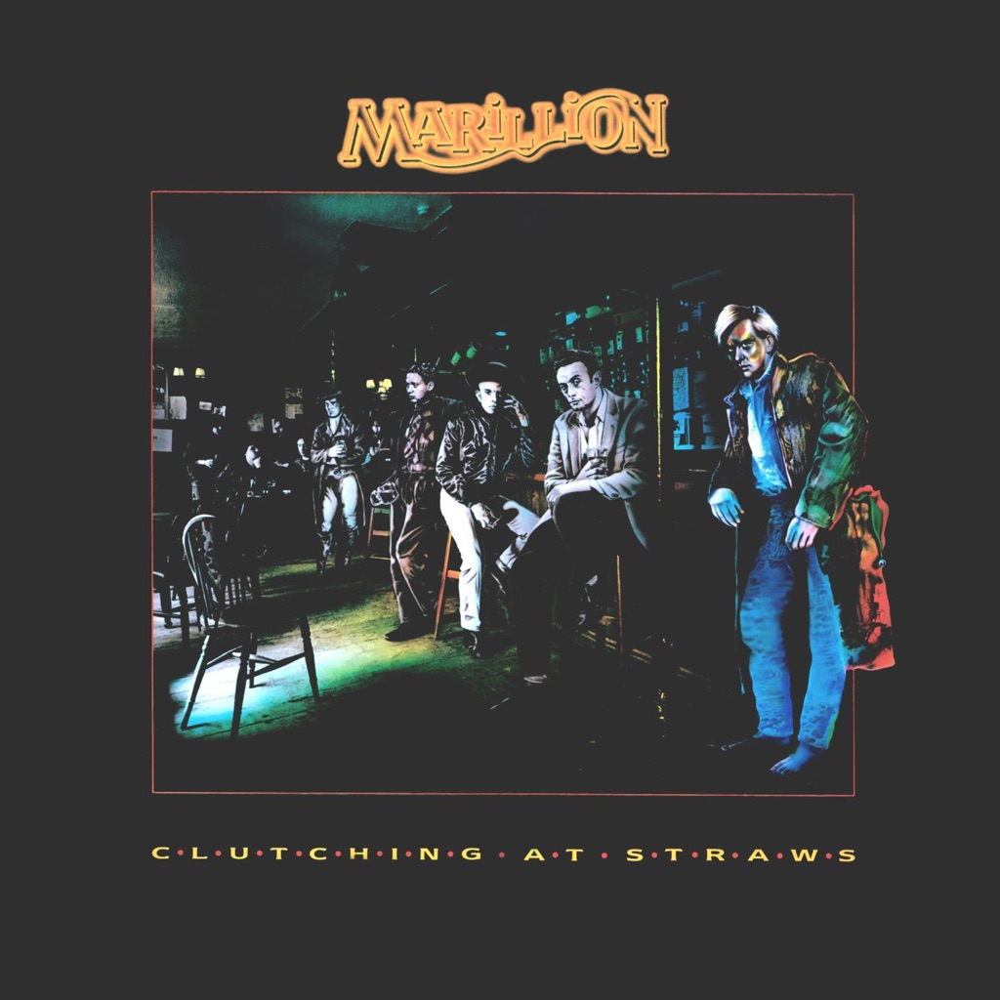

<!-- section break -->

1. Clutching At Straws (2018 Andy Bradfield & Avril Mackintosh Re-Mix)
2. Hotel Hobbies (3:35)
3. Warm Wet Circles (4:25)
4. That Time Of The Night (The Short Straw) (6:00)
5. Going Under (Alternate Version) (2:47)
6. Just For The Record (3:10)
7. White Russian (6:25)
8. Incommunicado (5:17)
9. Torch Song (4:04)
10. Slàinte Mhath (4:45)
11. Sugar Mice (5:46)
12. The Last Straw / Happy Ending (6:00)
13. Live At The Edinburgh Playhouse 19th December 1987 (2018 Michael Hunter Mix)
14. La Gazza Ladra (2:46)
15. Slàinte Mhath (5:03)
16. Assassing (6:47)
17. White Russian (6:25)
18. Incubus (10:36)
19. Sugar Mice (6:14)
20. Fugazi (9:57)
21. Hotel Hobbies (4:04)
22. Warm Wet Circles (4:17)
23. That Time Of The Night (The Short Straw) (6:00)
24. Pseudo Silk Kimono (Intro) (1:06)
25. Kayleigh (3:48)
26. Lavender (2:34)
27. Bitter Suite (8:21)
28. Heart Of Lothian (7:23)
29. The Last Straw (7:16)
30. Incommunicado (5:00)
31. Garden Party (6:26)

<!-- section break -->

## Spotify


## Release Information
|  Key           | Value                                                |
| ---------------| ---------------------------------------------------- |
| Release Year   | 2018                                   |
| Discogs Link   | [Marillion - Clutching At Straws](https://www.discogs.com/release/12802669-Marillion-Clutching-At-Straws) |
| Label          | Parlophone |
| Format         | Vinyl 2× LP Album Reissue Remastered, Vinyl 3× LP, Box Set Deluxe Edition Limited Edition Stereo (180 Gram) |
| Catalog Number | 0190295605179 |
| Notes | ALBUM INFORMATION: This is the vinyl box set version of a brand new (2018) Stereo Remix of Marillion's 1987 album Clutching At Straws.  LPs one and two feature a brand new stereo remix of the album by Andy Bradfield & Avril Mackintosh. LPs three, four and five contain Marillion’s December 19th, 1987 concert at The Edinburgh Playhouse, remixed by Michael Hunter.  ℗ 2018 this compilation Parlophone Records Ltd.  © 2018 Parlophone Records Ltd. This label copy information is the subject of copyrights protection. All rights reserved. © 2018 Parlophone Records Ltd. A Warner Music Group Company.  All runouts are etched.  |