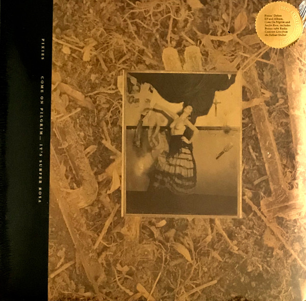

<!-- section break -->

1. Come On Pilgrim
2. Caribou
3. Vamos
4. Isla De Encanta
5. Ed Is Dead
6. The Holiday Song
7. Nimrod's Son
8. I've Been Tired
9. Levitate Me
10. Surfer Rosa
11. Bone Machine
12. Break My Body
13. Something Against You
14. Broken Face
15. Gigantic
16. River Euphrates
17. Where Is My Mind?
18. Cactus
19. Tony's Theme
20. Oh My Golly!
21. Vamos
22. I'm Amazed
23. Brick Is Red
24. Live From The Fallout Shelter
25. The Holiday Song
26. I'm Amazed
27. Rock A My Soul
28. Isla De Encanta
29. Caribou
30. Broken Face
31. Subbacultcha
32. Build High
33. Ed Is Dead
34. Nimrod's Son
35. Down To The Well 
36. I've Been Tired
37. Boom Chicka Boom
38. Vamos
39. In Heaven

<!-- section break -->

## Release Information
|  Key           | Value                                                |
| ---------------| ---------------------------------------------------- |
| Release Year   | 2018                                   |
| Discogs Link   | [Pixies - Come On Pilgrim... It's Surfer Rosa](https://www.discogs.com/release/12571941-Pixies-Come-On-Pilgrim-Its-Surfer-Rosa) |
| Label          | 4AD |
| Format         | Vinyl LP Mini-Album Reissue (Gold), Vinyl LP Album Reissue (Gold), Vinyl LP (Gold), All Media Compilation (30th Anniversary) |
| Catalog Number | 4AD0084LP |
| Notes | Triple LP set on gold/bronze 180g vinyl in wide spine cover with download card for the live concert. Each LP comes in a custom inner sleeve. Tracks on each LP are continuously numbered across sides.  Sticker: 30th Anniversary Edition Pixies' Debut EP and Album, Come On Pilgrim and Surfer Rosa, includes Bonus 1986 Radio Concert Live from the Fallout Shelter  Come On Pilgrim: Recorded at Fort Apache, Roxbury, MA in March 1987 Come On Pilgrim all works by Frank Black published by Rice and Beans Music (BMI) administered by Universal/MCA Music Limited except Levitate Me written by Jean Walsh, David Lovering and Frank Black published by Rice and Beans Music (BMI) administered by Universal/MCA Music Limited.  Surfer Rosa: Recorded and Mixed at Q Division, Boston, Massachusetts, U.S.A. Surfer Rosa published by Rice and Beans Music (BMI) administered by Universal/MCA Music Limited except Gigantic, written by Frank Black Published by Rice and Beans Music (BMI) administered by Universal/MCA Music Limitedand Mrs. John Murphy Published by EMI Publishing Limited.  Live From The Fallout Shelter: All Songs from Live From The Fallout Shelter written and published as above except Rock A My Soul and Boom Chicka Boom by Frank Black and In Heaven written by David Lynch and Peter Ivers and published by Paul Music. Licensed courtesy of The University of Massachusetts Lowell and WUML 91.5 FM. Mixed live to stereo broadcast, 15 Dec. 1986, on the WJUL radio program Live From the Fallout Shelter. Interview hosted by Mark Colacito.  'Live From The Fallout Shelter' is one of the earliest recordings of the band, a radio concert that first aired in late 1986 on [l=WJUL]-FM in Lowell, MA. |