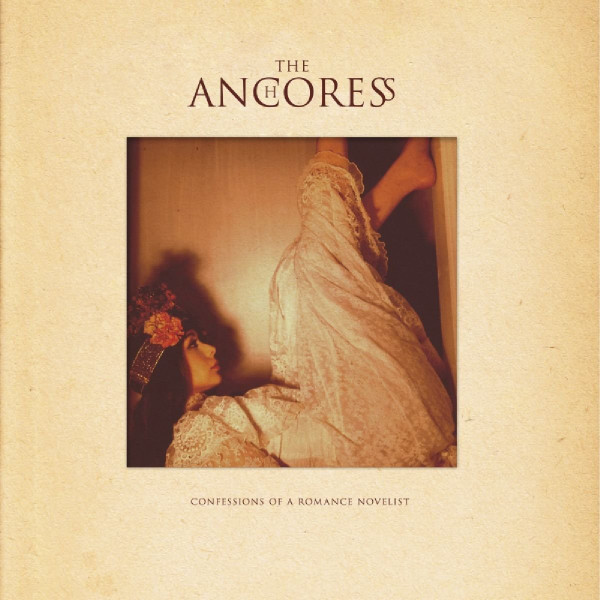

<!-- section break -->

1. Long Year (3:52)
2. What Goes Around (4:17)
3. Doesn't Kill You (4:40)
4. You And Only You (4:09)
5. One For Sorrow (3:24)
6. P.S. Fuck You (3:19)
7. Popular (3:57)
8. Bury Me (3:43)
9. Intermission (Notes To The Editor) (2:09)
10. Waiting To Breathe (3:03)
11. Chip On Your Shoulder (2:58)
12. Confessions Of A Romance Novelist (6:26)
13. You And Only You (Acoustic Version) (4:50)
14. Bury Me ( Acoustic Version ) (3:46)
15. Long Year (Acoustic Version) (3:33)
16. Popular (Acoustic Version) (2:23)

<!-- section break -->

## Spotify


## Videos
### The Anchoress - Doesn't Kill You (from Confessions of a Romance Novelist)
 

### More Videos

- [Confessions of a Romance Novelist](https://www.youtube.com/watch?v=6ul6hypmC30)
- [The Anchoress - Popular (from Confessions of a Romance Novelist)](https://www.youtube.com/watch?v=K7TK2k1jtjw)

## Release Information
|  Key           | Value                                                |
| ---------------| ---------------------------------------------------- |
| Release Year   | 2016                                   |
| Discogs Link   | [The Anchoress - Confessions Of A Romance Novelist](https://www.discogs.com/release/9221307-The-Anchoress-Confessions-Of-A-Romance-Novelist) |
| Label          | Kscope |
| Format         | Vinyl 2× LP Album |
| Catalog Number | KSCOPE920 |
| Notes | Sticker in front says: 2LP Gatefold 180g VINYL with Download Code "A rich and complex debut. A blackly witty breakup album ... compelling." THE OBSERVER "Kate Bush's Hounds of Love ... updated for the 21st century." PROG "Karen Carpenter singing John Grant." UNCUT "Fascinating" SUNDAY TIMES **** MOJO includes 4 new bonus acoustic tracks. kscope920 kscopemusic.com/theanchoress  |