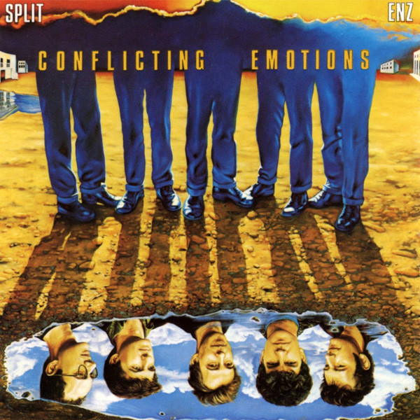

<!-- section break -->

1. Strait Old Line (4:00)
2. Bullet Brain And Cactus Head (3:55)
3. Message To My Girl (4:02)
4. Working Up An Appetite (4:05)
5. Our Day (4:54)
6. No Mischief (4:14)
7. The Devil You Know (3:34)
8. I Wake Up Every Night (4:45)
9. Conflicting Emotions (4:31)
10. Bon Voyage (4:02)

<!-- section break -->

## Spotify


## Videos
### Split Enz - Message To My Girl
 

### More Videos

- [Split Enz - The Devil You Know](https://www.youtube.com/watch?v=7WGCQqYlgZQ)
- [Audiosurf - Split enz - Bon voyage](https://www.youtube.com/watch?v=e7FqT3T1_q4)
- [Audiosurf - Split enz - Our day](https://www.youtube.com/watch?v=0D8WfeT9f0o)

## Release Information
|  Key           | Value                                                |
| ---------------| ---------------------------------------------------- |
| Release Year   | 1984                                   |
| Discogs Link   | [Split Enz - Conflicting Emotions](https://www.discogs.com/release/2243861-Split-Enz-Conflicting-Emotions) |
| Label          | A&M Records |
| Format         | Vinyl LP Album Stereo |
| Catalog Number | AMLX 64963 |
| Notes | Includes inner sleeve with lyrics and credits.  Some copies came with hype sticker  "featuring  TIM FINN  64963"  Made in Holland.  Similar to [r=13033729] but with both stampers from EDP |